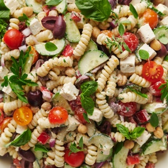

# [Pasta Salad, Greek](https://bakerbynature.com/20-minute-greek-pasta-salad/)
> **tags**: #Salad #0star

## Description

## Ingredients

- 1 pound farfalle pasta
- 1 large English cucumber
- 2 cups cherry tomatoes
- 1/4 cup fresh parsley
- 3/4 cup kalamata olives pitted and cut in half
- 3/4 cup chickpeas drained and patted dry
- 1/2 cup red onion diced
- 1 8-ounce container crumbled feta
- 2 cloves garlic, minced
- 1/3 cup olive oil
- 3 tablespoons red wine vinegar
- 2 teaspoons granulated sugar
- 1/2 teaspoon salt (more or less to taste)
- 1/2 teaspoon black pepper (more or less to taste)
- 1 cup tzatziki sauce

## Directions
Place a large pot of salted water over high heat; bring to a rolling boil. Add pasta and cook until al dente, 8 to 10 minutes.

While the water comes to a boil and the pasta cooks, prepare the vegetables and dressing. Halve the cucumbers lengthwise and remove the seeds with small spoon; slice into half-moons and set aside. Slice the cherry tomatoes in half; finely chop the parsley; slice the olives in half; dice the onion; set aside.

In a small bowl combine the minced garlic, olive oil, vinegar, sugar, salt, and pepper; whisk well to combine. Add in the tzatziki sauce and mix well; season to taste.

When the pasta has finished cooking, drain it at once and quickly rinse it under cold water until cool, about 1 minute. Place cooled pasta in a large mixing bowl. Add dressing to pasta and toss well to coat.

Add the chopped cucumbers, tomatoes, parsley, olives, onion, chickpeas, and feta and toss to combine. Serve at once, or chill until needed.

## Notes

## Data
**prep** 10 mins | **cook** 10 mins | **total**  | **serves** 8 servings