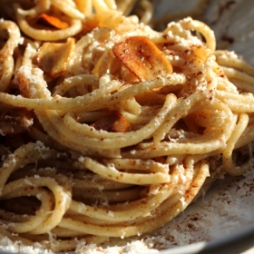

# [Pasta Yia Yia](https://www.kilnandkitchen.com/recipes/pasta-yia-yia)
> **tags**: #Pasta #0star

## Description

## Ingredients

- 1/2lb pasta (I used spaghetti, Lula uses bucatini)
- 6 tbsp butter
- 6 large cloves of garlic, sliced into thin chips
- 1/2 tsp salt
- 1/2 tsp cinnamon
- 4oz feta cheese

## Directions
Cook pasta according to package instructions, making sure to reserve some salty pasta water.

In a large sauté pan, melt butter over medium low heat. Once the butter is melted, add the garlic.

Cook the garlic and butter until the butter is browned and the garlic is golden brown & crispy. Remove the garlic from the butter and set aside.

Add the cooked pasta, cinnamon, and salt to the brown butter. Stir well to coat each noodle. Add a little bit of pasta water to help everything come together.

Top with the toasted garlic chips, feta cheese, and a lil extra sprinkle of cinnamon.

## Notes

## Data
**prep**  | **cook**  | **total**  | **serves** Yield: 4ish servings