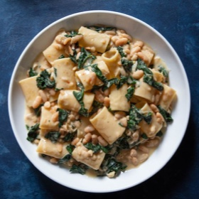

# [Pasta with Beans and Greens](https://www.seriouseats.com/pasta-with-beans-and-greens)
> **tags**: #Italian #Pasta #0star

## Description

## Ingredients

- 1/4 cup (60ml) extra-virgin olive oil
- 4 medium garlic cloves (20g), thinly sliced
- 3 anchovy fillets (5g) (optional; see note)
- 1/2 teaspoon (1g) red pepper flakes
- 1/4 cup (60ml) dry white wine
- 1 pound 5 ounces (3 cups; 600g) cooked dry white beans (such as cannellini or Great Northern) or two (15-ounce; 425g) cans low-sodium white beans, drained and rinsed (see note)
- 1 cup (240ml) bean cooking liquid, homemade or store-bought low-sodium chicken stock, or vegetable stock (see note)
- Kosher salt
- 12 ounces (350g) short tubular pasta, such as paccheri or rigatoni
- 1 bunch (8 ounces; 225g) lacinato kale, tough stems removed, leaves cut into 2-inch pieces (see note)
- 2 1/4 ounces (3/4 cup; 65g) grated Pecorino Romano cheese, divided

## Directions
In a large straight-sided sauté pan or skillet, combine olive oil, garlic, and anchovies (if using). Cook over medium-low heat, stirring and breaking up anchovies occasionally with a wooden spoon, until anchovies have dissolved and garlic has softened and is just beginning to turn lightly golden, about 5 minutes. Add red pepper flakes and continue to cook, stirring, until fragrant, about 30 seconds. Increase heat to medium-high and add wine. Bring to a simmer and cook, swirling pan and scraping up any stuck-on bits with a wooden spoon, until wine has emulsified with olive oil and mixture is slightly reduced, about 30 seconds.

Add beans and bean cooking liquid (if using cooked dry beans) or stock (if using canned beans), and, using a wooden spoon, crush roughly one-quarter of the beans against the sides and bottom of pan. Stir well, season lightly with salt, and bring to a simmer. Reduce heat to medium-low and cook, stirring occasionally, until bean mixture is thickened to a creamy, saucy consistency, 10 to 15 minutes.

Meanwhile, in a pot of salted boiling water, cook pasta until softened on the exterior, but well shy of al dente and still uncooked in the center (about 3 minutes less than the package directions). Right before the pasta reaches this level of doneness, add the kale to the pan with the beans. Using a spider skimmer or slotted spoon, transfer pasta to pan with beans and kale along with 1 cup (240ml) pasta cooking water. Alternatively, drain pasta using a colander or fine-mesh strainer, making sure to reserve at least 2 cups (475ml) pasta cooking water.

Increase heat to high and cook, stirring and tossing rapidly, until pasta is al dente and sauce is thickened and coats noodles, 2 to 3 minutes, adding more pasta cooking water in 1/4 cup (60ml) increments as needed. At this point, the sauce should coat the pasta but still be loose enough to pool around the edges of the pan; because of the starch in the beans and pasta water, the sauce will continue to tighten up in the time it takes to plate and serve, so make sure it's a little looser than you would normally serve a sauce. Remove from heat, add 3/4 of grated cheese, and stir rapidly to incorporate. Season with salt to taste. Serve immediately, passing remaining grated cheese at the table.

## Notes

## Data
**prep** 5 mins | **cook** 30 mins | **total**  | **serves** 4 servings