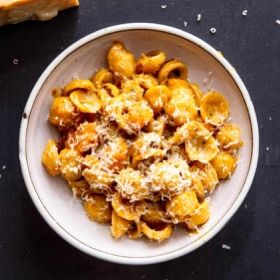

# [Pasta with Butternut Squash and Sage Brown Butter](https://www.seriouseats.com/pasta-butternut-squash-sage-brown-butter-recipe)
> **tags**: #Pasta #5star

## Description

## Ingredients

- 2 tablespoons olive oil (30ml)
- 1 pound butternut squash, peeled, seeded, and cut into 1/2-inch cubes (450g; about 1/2 large squash)
- salt
- black pepper
- 2 tablespoons unsalted butter (30g)
- 1 small shallot, finely minced (about 1 ounce; 30g)
- 1 handful fresh sage leaves, finely minced (about 1/2 ounce; 15g)
- 1 tablespoon juice from 1 lemon (15ml)
- 1 pound small cupped, tubular, or ridged pasta such as orecchiette, penne, farfalle, or rotini (450g)
- 1 ounce grated fresh Parmigiano-Reggiano cheese (30g)

## Directions
Heat olive oil in a large stainless steel or cast-iron skillet over high heat until very lightly smoking. Immediately add squash, season with salt and pepper, and cook, stirring and tossing occasionally, until well-browned and squash is tender, about 5 minutes. Add butter and shallots and continue cooking, stirring frequently, until butter is lightly browned and smells nutty, about 1 minute longer. Add sage and stir to combine (sage should crackle and let off a great aroma). Remove from heat and stir in lemon juice. Set aside.

Serious Eats / J. Kenji López-Alt

In a medium saucepan, combine pasta with enough room temperature or hot water to cover by about 2 inches. Season with salt. Set over high heat and bring to a boil while stirring frequently. Cook, stirring frequently, until pasta is just shy of al dente, about 2 minutes less than the package directions. Drain pasta, reserving a couple cups of the starchy cooking liquid.

Add pasta to skillet with squash along with a splash of pasta water. Bring to a simmer over high heat and cook until the pasta is perfectly al dente, stirring and tossing constantly and adding a splash of water as needed to keep the sauce loose and shiny. Off heat, stir in Parmigiano-Reggiano. Adjust seasoning with salt and pepper and texture with more pasta water as needed. Serve immediately, top with more cheese at the table.

Serious Eats / Vicky Wasik

## Notes

## Data
**prep**  | **cook** 25 mins | **total**  | **serves** 4 to 6 servings