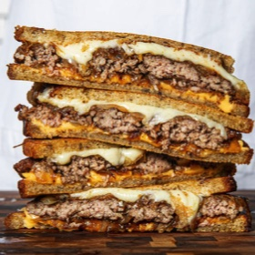

# [Patty Melt](https://www.seriouseats.com/the-ultimate-patty-melt)
> **tags**: # #0star

## Description

## Ingredients

- 6 tablespoons (90g) butter
- 4 slices Deli-style rye bread
- 4 slices American cheese, torn into large pieces (optional; see note)
- 4 slices Swiss cheese, torn into large pieces
- Kosher salt
- Freshly ground black pepper
- 1/2 pound (226g) freshly ground chuck, formed into two 4-ounce patties, roughly the size and shape of 1 slice bread
- 1 large yellow onion (10 ounces; 283g), split in half, sliced thin from pole to pole (about 2 cups)
- 1/2 cup (118ml) water

## Directions
Melt 1 tablespoon butter in a 12-inch heavy-bottomed skillet over medium heat until foaming. Add 2 slices bread and swirl around pan using hand or spatula. Cook, swirling occasionally until pale golden brown, about 3 minutes. Transfer to cutting board cooked-side up. Divide American cheese evenly between slices, layering them in the center and leaving a 1/4-inch gap around the edges.

Repeat step 1 with remaining bread slices and Swiss cheese.

Season hamburger patties on both sides with salt and pepper. Return skillet to heat to high and melt 1 tablespoon butter in skillet until light brown. Swirl to coat bottom of skillet and add both burger patties. Cook without moving until dark brown crust forms on first side, about 1 1/2 minutes, reducing heat to medium if butter begins to burn or smoke excessively. Flip burgers using spatula and cook on second side without moving until crust develops, 1 1/2 minutes longer.

Transfer burger patties to plate and reduce heat to medium. Add onions, 1 tablespoon butter, and 2 tablespoons water to skillet. Season with salt and pepper. Cook, stirring constantly and scraping up browned bits from bottom of skillet until water evaporates and onions start to fry and leave brown residue on bottom of pan. Add another 2 tablespoons water and continue to cook. Repeat 2 more times until water is used up and onions are soft and deep golden brown. Add collected juices from meat plate to onions and continue to cook for 30 seconds. Onions should be moist, but not dripping.

Divide onion mixture evenly between cheese-topped toast slices. Add burger patties to slices with American cheese and close sandwiches.

Add 1 tablespoon butter to skillet. Return to medium heat and cook until butter melts. Sprinkle with salt. Swirl to coat pan and add sandwiches. Cook, swirling sandwiches around pan frequently until deep golden brown on bottom, about 5 minutes. Remove sandwiches from skillet, melt remaining tablespoon butter in pan and sprinkle with salt. Return sandwiches to skillet and cook, swirling frequently until second side is golden brown and cheese is melted. Serve immediately.

## Notes

## Data
**prep** 5 mins | **cook** 30 mins | **total**  | **serves** 2 servings