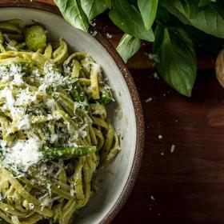

# [Pesto Alla Genovese](https://www.seriouseats.com/best-pesto-recipe)
> **tags**: #Pasta #0star

## Description

## Ingredients

- 2 medium cloves garlic (10g)
- 2 tablespoons pine nuts (about 1 ounce; 30g)
- 3 ounces basil leaves (85g), from about a 4-ounce bunch, washed with water still clinging to the leaves (about 4 cups basil leaves)
- Coarse sea salt, as needed
- 3/4 ounce grated Parmigiano Reggiano (about 2 tablespoons; 21g)
- 3/4 ounce Pecorino Fiore Sardo (about 2 tablespoons; 21g), see note
- 3/4 cup (175ml) mildly flavored extra-virgin olive oil

## Directions
Using a marble mortar and wooden pestle (see note), pound the garlic to a paste.

Add pine nuts and continue to crush with pestle, smashing and grinding them, until a sticky, only slightly chunky, beige paste forms.

Add basil leaves a handful at a time and pound and grind against the walls of the mortar. Add pinch of salt with each handful to act as an abrasive. Continue until all basil leaves have been crushed to fine bits.

Add both cheeses, then slowly drizzle in olive oil, working it into the pesto with the pestle until a fairly smooth, creamy, emulsified sauce forms. Add more oil, if desired.

Pesto can be served with pasta right away or transferred to a jar or container, covered with a thin layer of olive oil, and sealed and refrigerated overnight.

## Notes

## Data
**prep** 30 mins | **cook** 30 mins | **total**  | **serves** 4 servings