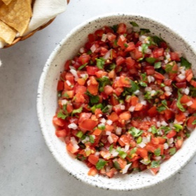

# [Pico De Gallo](https://www.seriouseats.com/classic-pico-de-gallo-salsa-fresca-recipe)
> **tags**: #Mexican #0star

## Description

## Ingredients

- 1 1/2 pounds (680g) ripe tomatoes, cut into 1/4- to 1/2-inch dice (about 3 cups); see notes
- Kosher salt
- 1/2 large white onion, finely diced (about 3/4 cup)
- 1 to 2 serrano or jalapeño chiles, finely diced (seeds and membranes removed for a milder salsa)
- 1/2 cup finely chopped fresh cilantro leaves
- 1 tablespoon (15ml) lime juice from 1 lime

## Directions
Season tomatoes with 1 teaspoon (4g) salt and toss to combine. Transfer to a fine-mesh strainer or colander set in a bowl and allow to drain for 20 to 30 minutes. Discard liquid.

Lynn Wolsted

Combine drained tomatoes with onion, chiles, cilantro, and lime juice. Toss to combine and season to taste with salt. Pico de gallo can be stored for up to 3 days in a sealed container in the refrigerator.

## Notes

## Data
**prep** 10 mins | **cook** 40 mins | **total**  | **serves** 16 servings