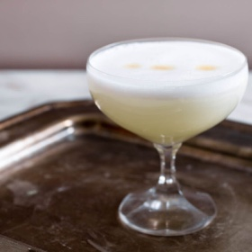

# [Pisco Sour](https://www.seriouseats.com/pisco-sour)
> **tags**: #Drinks #0star

## Description

## Ingredients

- 3 ounces pisco (see note)
- 1 ounce fresh-squeezed lime juice
- 3/4 ounce simple syrup (see note)
- 1 fresh egg white
- 1 dash Angostura or Amargo bitters

## Directions
Combine pisco, lime, simple syrup, and egg white in a cocktail shaker without ice and seal. Shake vigorously until egg white is foamy, about 10 seconds. Add ice to shaker and shake again very hard until well-chilled, about 10 seconds. Strain into chilled cocktail glass; dash bitters atop the egg-white foam.

For simple syrup: In a jar, combine 1 cup water with 1 cup superfine sugar. Seal jar and shake until sugar is completely dissolved. Keep remainder refrigerated.

## Notes

## Data
**prep** 5 mins | **cook** 5 mins | **total**  | **serves** 1 serving