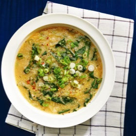

# [Polenta and Kale Soup with Miso and Toasted Sesame Oil](https://www.seriouseats.com/vegan-polenta-kale-soup-miso-recipe)
> **tags**: #Soup #To Try #0star

## Description

## Ingredients

- 6 tablespoons (90ml) extra-virgin olive oil
- 1 large leek (about 10 ounces; 283g), white and light green parts only, finely chopped (about 1 1/4 cups)
- Kosher salt and freshly ground black pepper
- 3 medium cloves garlic, minced
- Large pinch red pepper flakes
- 2 quarts (1.9L) homemade unsalted hearty vegetable stock, easy vegetable stock, or dashi
- 1 cup dried polenta (5 1/2 ounces; 156g)
- 3 1/2 ounces (99g) stemmed and roughly chopped lacinato kale (about 1 packed quart, from one 8-ounce bunch)
- 2 tablespoons (30g) white miso paste, plus more to taste
- 2 teaspoons (10ml) soy sauce, plus more to taste
- 4 medium scallions (about 3 ounces/85g total), thinly sliced (about 1 cup), divided
- Toasted sesame oil, for serving

## Directions
In a large saucepan, heat olive oil, leeks, and a pinch of salt over medium-low heat, stirring often, until very soft but not browned, about 6 minutes. Add garlic and red pepper flakes and cook, stirring constantly, until fragrant, about 1 minute. Add vegetable stock.

Whisking constantly, slowly pour in the polenta. Stirring frequently, bring to a boil over high heat, reduce heat to low, cover, and cook, stirring occasionally, until polenta is tender and the soup is thickened, about 15 minutes.

Stir in kale, cover, and cook, stirring occasionally, until kale is tender, about 5 minutes. Stir in miso, soy sauce, and half of scallions until miso is fully incorporated. Season to taste with salt, pepper, and/or additional miso and soy sauce, if desired.

Serve, drizzling with sesame oil and sprinkling with remaining scallions. Extra soup can be stored in the refrigerator in a sealed container for up to 5 days.

## Notes

## Data
**prep** 15 mins | **cook** 50 mins | **total**  | **serves** 6 to 8 servings