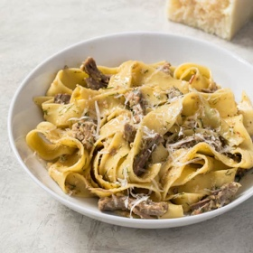

# [Pork, Fennel, and Lemon Ragu with Pappardelle](https://www.americastestkitchen.com/recipes/11304-pork-fennel-and-lemon-ragu-with-pappardelle)
> **tags**: #Pasta #0star

## Description

## Ingredients

- Gather Your Ingredients
- 4 ounces pancetta, chopped
- 1 large onion, chopped fine
- 1 large fennel bulb, 2 tablespoons fronds chopped, stalks discarded, bulb halved, cored, and chopped fine, divided
- 4 garlic clove, minced
- 1 1/2 teaspoons table salt, plus salt for cooking pasta
- 2 teaspoons minced fresh thyme
- 1 teaspoon pepper
- 1/3 cup heavy cream
- 1 (11/2-pound) boneless pork butt roast, well trimmed and cut in half across grain
- 1 1/2 teaspoons grated lemon zest plus 1/4 cup juice (2 lemons)
- 12 ounces pappardelle
- 2 ounces Pecorino Romano cheese, grated (1 cup), plus extra for serving

## Directions
Adjust oven rack to middle position and heat oven to 350 degrees. Cook pancetta and ⅔ cup water in Dutch oven over medium-high heat, stirring occasionally, until water has evaporated and dark fond forms on bottom of pot, 8 to 10 minutes. Add onion and fennel bulb and cook, stirring occasionally, until vegetables soften and start to brown, 5 to 7 minutes. Stir in garlic, salt, thyme, and pepper and cook until fragrant, about 30 seconds.

Stir in cream and 2 cups water, scraping up any browned bits. Add pork and bring to boil over high heat. Cover, transfer to oven, and cook until pork is tender, about 1½ hours.

Transfer pork to large plate and let cool for 15 minutes. Cover pot so fond will steam and soften. Using spatula, scrape browned bits from sides of pot and stir into sauce. Stir in lemon zest and juice.

While pork cools, bring 4 quarts water to boil in large pot. Using 2 forks, shred pork into bite-size pieces, discarding any large pieces of fat or connective tissue. Return pork and any juices to Dutch oven. Cover and keep warm.

Add pasta and 1 tablespoon salt to boiling water and cook, stirring occasionally, until al dente. Reserve 2 cups cooking water, then drain pasta and add it to Dutch oven. Add Pecorino and ¾ cup reserved cooking water and stir until sauce is slightly thickened and cheese is fully melted, 2 to 3 minutes. If desired, stir in remaining reserved cooking water, ¼ cup at a time, to adjust sauce consistency. Season with salt and pepper to taste and sprinkle with fennel fronds. Serve immediately, passing extra Pecorino separately.

## Notes

## Data
**prep**  | **cook**  | **total**  | **serves** Serves 4 to 6