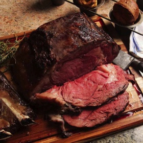

# [Prime Rib, Roasted and Reverse Seared](https://www.seriouseats.com/perfect-prime-rib-beef-recipe)
> **tags**: # #0star

## Description

## Ingredients

- 1 standing rib roast (prime rib), 3 to 12 pounds (1.3 to 5.4kg; see note)
- Kosher salt and freshly ground black pepper

## Directions
Preheat oven to lowest possible temperature setting, 150°F (66°C) or higher if necessary. (Some ovens cannot hold a temperature below 250°F/121°C.) Season roast generously with salt and pepper. Place roast, with fat cap up, on a V-rack set in a large roasting pan, or on a wire rack set in a rimmed baking sheet. Place in oven and cook until center of roast registers 120-125°F (49-52°C) on an instant-read thermometer for rare, 130°F (54°C) for medium-rare, or 135°F (57°C) for medium to medium-well. In a 150°F oven, this will take around 5 1/2 to 6 1/2 hours; in a 250°F oven, this will take 3 1/2 to 4 hours.

Remove roast from oven and tent loosely with aluminum foil. Place in a warm spot in the kitchen and allow to rest for at least 30 minutes and up to 1 1/2 hours. Meanwhile, preheat oven to highest possible temperature setting, 500 to 550°F (260 to 288°C).

Ten minutes before guests are ready to be served, remove foil, place roast back in hot oven, and cook until well-browned and crisp on the exterior, 6 to 10 minutes. Remove from oven, carve, and serve immediately.

## Notes
This recipe works for prime rib roasts of any size from two ribs to six ribs. Plan on one pound of bone-in roast per guest. (Each rib adds one and a half to two pounds to the roast.) For best results, use a dry-aged prime-grade or grass-fed roast.

To improve the crust, allow the roast to air-dry, uncovered, on a rack in the refrigerator overnight before roasting. Seasoning with salt up to a day in advance will help the seasoning penetrate the meat more deeply. If, after step 1, your timing is off, and your roast is ready long before your guests are, reheat the roast by placing it in a 200°F (93°C) oven for 45 minutes before you continue with step 2.

## Data
**prep** 10 mins | **cook** 4 hrs 40 mins | **total**  | **serves** 3 to 12 servings