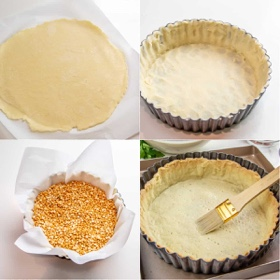

# [Quiche Lorraine](https://natashaskitchen.com/quiche-lorraine/)
> **tags**: #Mains #0star

## Description

## Ingredients

- 1 pie crust, (1 frozen crust, or 1/2 recipe for double pie crust)
- 1/2 lb thin strips of bacon, chopped into 1/2 inch pieces
- 1/2 onion, diced
- 1 cup shredded cheese , (I used sharp white cheddar, but gruyere is classic)
- 1 3/4 cup half and half, (or equal parts whole milk and heavy cream)
- 4 eggs
- 1/2 tsp salt
- 1/4 tsp black pepper, finely ground
- 1/4 tsp paprika
- 1/8 tsp nutmeg

## Directions
Prepare the Pie Crust:

Prepare the homemade pie crust and chill, or use store-bought pie crust. Roll out 1 pie crust to 12" on a lightly floured surface or between two pieces of parchment paper, then transfer to the tart pan*. Press the pastry dough into the pan with your fingers to mold to the pan. Freeze for about 30 minutes, meanwhile, preheat the oven to 350˚F with the rack in the middle.

Pre-Bake the Crust:

If using a store-bought crust, follow the package instructions for pre-baking. Otherwise, remove the prepared pastry tart from the freezer and blind bake it by first poking the bottom with a fork about every inch or so. Next, line the tart with parchment paper or foil allowing the ends to stick out a couple of inches above the tart edges.

If using a tart pan with a removable bottom, place it on a rimmed baking sheet. Fill the inside with pie weights** 3/4 full and bake at 350˚F for about 35-40 minutes or until the tart is mostly baked through and light golden color. Remove from the oven, remove the pie weights and parchment. Brush the inside of the baked tart with a whisked egg white - this will prevent the crust from becoming soggy from the filling.

Make the Savory Egg Filling:

While pie is pre-baking, preheat a large skillet over medium heat and add chopped bacon. Cook, stirring often until the fat is rendered and the bacon is crisp. Remove bacon with a slotted spoon to a separate dish. Add the diced onions to the bacon fat and cook stirring often until the onions are golden. Remove with a slotted spoon to the dish with the bacon.

In a large bowl whisk 4 eggs, then add 1 3/4 cups half and half, 1/2 tsp salt, 1/4 tsp pepper, 1/4 tsp paprika and 1/8 tsp of nutmeg and whisk together for about a minutes to incorporate a little bit of air into the custard. Stir in the cheese, prepared bacon and onion then pour the filling into the prebaked crust.

Bake the Quiche Lorraine:

Bake the quiche Lorraine in a preheated 350˚F oven for about 50 minutes, or until a knife inserted into the middle comes out clean and the center jiggles slightly. The quiche will continue cooking after it is removed from the oven. Cool slightly before serving and garnish with parsley if desired.

## Notes
*You can use an 8" x 1 3/4" tart pan with a removable bottom, or an 8" inch round, 1 3/4" tall pie pan.

**If you don't have ceramic pie weights, you can also use dried beans, dried peas or rice.

## Data
**prep** 2 hrs | **cook** 50 mins | **total**  | **serves** Servings: 8