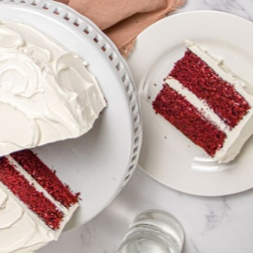

# [Red Velvet Cake](https://www.seriouseats.com/red-velvet-cake-recipe-8563765)
> **tags**: #Dessert #0star

## Description

## Ingredients

- 265g all-purpose flour (2 cups plus 1 teaspoon)
- 50g natural unsweetened (not Dutch processed) cocoa powder (1/2 cup plus 1 tablespoon), plus extra for dusting cake pans
- 1 1/2 teaspoons baking soda
- 227g (1 cup) unsalted butter, room temperature, plus more for greasing
- 144g granulated sugar ( about 3/4 cup minus 1 teaspoon)
- 144g light brown sugar (about 2/3 cup lightly packed)
- 1 1/2 teaspoons Diamond Crystal kosher salt; for table salt, use half as much by volume
- 1 tablespoon (15ml) vanilla extract
- 1 tablespoon red gel paste food coloring (optional; see notes)
- 3 large eggs, room temperature
- 1 cup (240ml) buttermilk, room temperature
- To Frost the Cake:1 recipe Flour Frosting (a.k.a. Ermine Frosting), Cream Cheese Buttercream Frosting, or Fast and Easy Cream Cheese Frosting

## Directions
Adjust oven rack to middle position and preheat oven to 350°F (175°C). Grease two 8-inch round cake pans with butter and cover the bottom with a round of parchment paper. Lightly dust the insides of the cake pans with cocoa powder and discard any excess by tapping the pans upside down. (For cupcakes, line a muffin pan with baking cups.)

In a medium bowl, sift the flour, 50g cocoa, and baking soda together and lightly whisk to combine. Set aside.

In the bowl of a stand mixer fitted with the paddle attachment, beat the butter, granulated sugar, brown sugar, salt, and vanilla extract on low speed to roughly incorporate; then increase speed to medium and beat until soft, fluffy, and pale, 5 to 7 minutes, using a flexible spatula to scrape as needed.

With the mixer running on its lowest speed, drizzle in the food coloring (if using). Gradually increase the speed to medium and mix until the coloring is evenly distributed, about 30 seconds, stopping to scrape down the sides of the bowl if needed. With the mixer on low speed, add the eggs one by one, briefly increasing the mixer speed after each addition until each egg is fully incorporated. Once fully mixed, stop mixer and use a flexible spatula to scrape down the sides of the bowl.

Add a third of the flour-cocoa mixture to the butter-egg mixture, then start mixer on low speed and gradually increase to medium speed, until no dry flour remains, about 30 seconds. On low speed, slowly add a third of the buttermilk and beat until fully incorporated, about 30 seconds. Scrape down the bowl as needed, and repeat adding and alternating with half of the remaining flour mixture, half of the remaining buttermilk, then finally the remaining flour mixture, and the remaining buttermilk.With a rubber spatula, scrape the paddle clean and give the batter a final stir, making sure to scrape the bottom of the bowl.

For Cupcakes: Line standard-size muffin pan with baking-cup liners. Distribute the batter evenly among the baking cups so each is about 3/4 full. Bake for 24 to 26 minutes, or until a tester comes out clean. Repeat with remaining batter. Let cool completely before frosting. Once cool, use an offset spatula to spread the frosting on top of each cupcake.

For a Layer Cake: Scrape the batter into the prepared pans and bake until a toothpick or cake tester inserted into cake center comes out clean, 25 to 30 minutes. Cool cakes in their pans on a cooling rack for 15 minutes. Run an offset spatula or butter knife around edges of cakes, then invert cake onto a plate and transfer back to the rack to cool completely, at least 1 hour.

To Crumb Coat the Cake: Using a serrated knife, level cakes. Place one layer on a turntable. If you like, a waxed cardboard cake round can first be placed underneath, secured to the turntable with a scrap of damp paper towel. Top with 1 cup frosting, using an offset spatula to spread it evenly from edge to edge. Top with the second layer and cover the sides of the cake with 1 cup frosting, spread into an even and smooth layer. (Tutorial here.) Refrigerate cake until frosting is firm to the touch, about 30 minutes.

To Finish the Cake: Spread the top and sides of the cake with the remaining frosting to decorate as desired. Allow the cake to come to room temperature before serving.

## Notes

## Data
**prep** 30 mins | **cook** 25 mins | **total**  | **serves** 1 2-layer 8-inch cake or 22 cupcakes