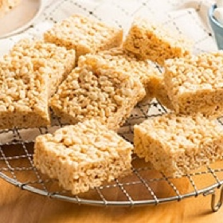

# [Rice Krispies Treats](https://www.ricekrispies.com/en_US/recipes/the-original-treats-recipe.html)
> **tags**: #Dessert #5star

## Description

## Ingredients

- 3 tablespoons butter
- 1 package (10 oz., about 40) JET-PUFFED Marshmallows
- OR
- 5-1/2 cups JET-PUFFED Miniature Marshmallows
- 6 cups Kellogg's® Rice Krispies® cereal

## Directions
1. In large saucepan melt butter over low heat. Add marshmallows and stir until completely melted. Remove from heat.

2. Add KELLOGG'S® RICE KRISPIES® cereal. Stir until well coated.

3. Using buttered spatula or wax paper evenly press mixture into 13 x 9 x 2-inch pan coated with cooking spray. Cool. Cut into 2-inch squares. Best if served the same day.

MICROWAVE DIRECTIONS:

In microwave-safe bowl heat butter and marshmallows on HIGH for 3 minutes, stirring after 2 minutes. Stir until smooth. Follow steps 2 and 3 above. Microwave cooking times may vary.

## Notes
For best results, use fresh marshmallows.

1 jar (7 oz.) marshmallow crème can be substituted for marshmallows.

Diet, reduced calorie or tub margarine is not recommended.

Store no more than two days at room temperature in airtight container.

To freeze, place in layers separated by wax paper in airtight container. Freeze for up to 6 weeks. Let stand at room temperature for 15 minutes before serving.

## Data
**prep** 10 | **cook** 30 | **total**  | **serves** 12