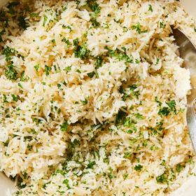

# [Rice Pilaf](https://cooking.nytimes.com/recipes/1025492-rice-pilaf)
> **tags**: # #0star

## Description

## Ingredients

- 2 cups white basmati rice
- 4 tablespoons unsalted butter, ghee or oil of choice
- 1 small yellow onion, finely chopped
- 4 garlic cloves, finely chopped
- 2 teaspoons kosher salt (such as Diamond Crystal)
- 1/2 teaspoon onion powder
- 1/2 teaspoon garlic powder
- 1/2 teaspoon black pepper
- 1/4 teaspoon paprika, smoked or sweet
- 3 1/2 cups chicken or vegetable broth or water
- 1/2 cup chopped parsley

## Directions
In a fine-meshed sieve, rinse the rice with cold water to rid the grains of excess starch. This makes for a fluffier rice that doesn’t clump. Set aside to thoroughly drain.

In a medium (3 1/2-quart) saucepan, heat the butter over medium. Add the onion and cook, stirring frequently, until softened, about 7 minutes. Adjust heat to medium-low, add the garlic and cook, stirring frequently, until fragrant, about 2 minutes. 

Adjust heat to medium, add the rice and cook, stirring frequently, until the grains are coated in the butter, are shiny and smell toasty, about 5 minutes. Take care not to burn the garlic, turning down the heat if necessary. Stir in the salt, onion powder, garlic powder, black pepper and paprika, and cook for 1 minute.

Add the broth, adjust heat to high and bring to a boil. As soon as the broth comes to a boil, cover and turn heat to low. Cook for about 15 minutes, until the water has been absorbed. Remove from the heat and allow the rice to steam, covered, for 10 minutes. 

Gently fluff with a slotted spatula as you fold in the parsley, taking care not to break too many grains, and serve.

## Notes
To add noodles: Swap 1 cup of rice for 1 cup of orzo or broken vermicelli, and add with the rice in Step 3.

## Data
**prep**  | **cook**  | **total** 10 min | **serves** 4 to 6 servings