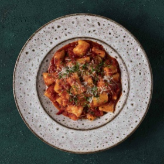

# [Ricotta Gnocchi](https://www.seriouseats.com/ricotta-gnocchi-homemade-food-lab-recipe)
> **tags**: #To Try #0star

## Description

## Ingredients

- 12 ounces best quality ricotta cheese (about 1 1/2 cups, see notes)
- 1 ounce finely grated Parmesan cheese (about 1/2 cup), plus more for serving
- 4 to 6 ounces all-purpose flour (about 1 cup)
- 1 whole large egg
- 1 large egg yolk
- Kosher salt and freshly ground black pepper
- Semolina flour, for dusting
- 2 cups your favorite marinara sauce, such as slow-cooked red sauce
- Extra-virgin olive oil
- Minced fresh herbs such as basil, parsley, or chives

## Directions
Line a large plate with three layers of paper towels or a clean dish towel. Transfer ricotta directly to paper towels and spread with a rubber spatula. Place another triple layer of paper towels or a clean dish towel on top and press down firmly with the palms of your hands to blot excess moisture. Peel off upper paper towels.

Spreading the ricotta on paper towels and then blotting it removes excess moisture. Here, the left side shows the ricotta before it's been drained and blotted, and the right side shows the texture of the ricotta after the excess moisture has been removed.

Place a large bowl on a scale and zero the scale. Scrape ricotta into bowl to weigh. Remove excess ricotta to leave exactly 8 ounces. Reserve excess ricotta for another use. Add Parmesan, 3 1/2 ounces of flour, whole egg, and egg yolk to bowl. Season with salt and pepper. Combine mixture with a rubber spatula. It should be sticky but not loose. Add flour a tablespoon at a time if it is still very moist after kneading with the spatula for 1 minute.

Transfer dough to a lightly floured work surface and dust the top with flour. Flatten into a 4- to 6-inch disk and cut into quarters using a bench scraper. Working one piece at a time, roll dough into a log about 6 inches long, dusting with flour as necessary. Split log in half and roll each half into a log about 12 inches long and 3/4-inch wide. You should end up with 8 logs.

Using your bench scraper, cut each log into 8 to 10 gnocchi. Transfer to a parchment-lined baking sheet dusted in semolina flour. Shake to lightly coat gnocchi and prevent sticking. At this point, gnocchi can be frozen. Transfer baking sheet to freezer until gnocchi are completely frozen, about 30 minutes. Transfer gnocchi to a zipper-lock freezer bag and freeze for up to 2 months. Cook directly from frozen, adding a few minutes to cooking time.

To cook, bring a large pot of salted water to a boil. Heat sauce in a separate saucepan until hot but not simmering. Add gnocchi to pot, stir gently, and cook until gnocchi float for 30 seconds, about 3 minutes total. Drain gnocchi, reserving 1/2 cup of pasta cooking water. Add gnocchi and 1/4 cup of cooking water to pot with sauce and bring to a hard boil, stirring gently. Add more pasta water to thin sauce to desired consistency. Season to taste with salt and pepper.

Stir in a big drizzle of olive oil and a handful of chopped fresh herbs. Transfer to a large serving plate. Sprinkle with more herbs and Parmesan cheese. Drizzle with more olive oil. Serve immediately.

## Notes

## Data
**prep** 30 mins | **cook** 15 mins | **total**  | **serves** 3 to 4 servings