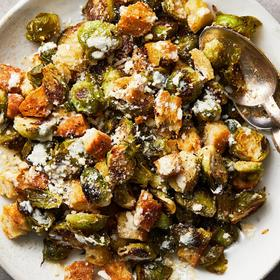

# [Roasted Brussels Sprouts Caesar with Tahini](https://cooking.nytimes.com/recipes/1025950-roasted-brussels-sprouts-caesar-with-tahini)
> **tags**: #Vegetarian #0star

## Description

## Ingredients

- 2 pounds brussels sprouts, ends trimmed, large ones quartered, smaller ones halved
- 6 tablespoons olive oil
- 1 teaspoon ground cumin
- 1/4 teaspoon crushed red pepper
- Salt and pepper
- 3 cups of 1/2-inch bread cubes (from about 1/2 French baguette or loaf of crusty bread)
- 1 large lemon, juiced (about 3 tablespoons)
- 2 tablespoons tahini
- 1 garlic clove, grated or minced
- 2 tablespoons plus 1/4 cup grated Parmesan

## Directions
Heat the oven to 425 degrees. On a sheet pan, drizzle the brussels sprouts with 3 tablespoons olive oil; season with the cumin and red pepper, plus salt and pepper. Toss until everything is glistening.

Roast until the brussels sprouts start to brown in spots, 12 to 15 minutes.

In a medium mixing or serving bowl, toss the bread with 1 tablespoon oil and season lightly with salt. Remove the brussels sprouts from the oven, move them around with a wooden spoon, spread out in an even layer and add the bread cubes on top. Cook until the sprouts are tender and browned and the bread toasted, 8 to 12 minutes more. 

Meanwhile, in the same bowl, combine the lemon juice, tahini and garlic with 2 tablespoons grated Parmesan, 2 tablespoons water and the remaining 2 tablespoons of olive oil until smooth. Remove the sheet pan from the oven. Drizzle with the dressing, sprinkle with most of the remaining ¼ cup cheese and toss to combine.

Transfer to the serving bowl or serve directly from the sheet pan. Garnish with the remaining cheese and a few grinds of pepper.

## Notes

## Data
**prep** 20 min | **cook** 30 min | **total** 50 min | **serves** 4 servings