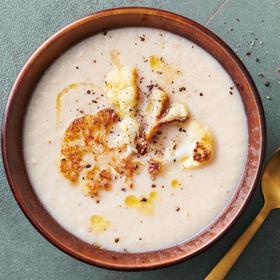

# [Roasted Cauliflower and Garlic Soup](https://cooking.nytimes.com/recipes/1025127-roasted-cauliflower-and-garlic-soup)
> **tags**: #Soup #0star

## Description

## Ingredients

- 2 1/2 pounds cauliflower (1 very large head), cut into 1-inch florets, leaves reserved
- 1/4 cup extra-virgin olive oil, plus more for drizzling
- Salt and pepper
- 1 head garlic

## Directions
Heat the oven to 425 degrees. On a sheet pan, toss the cauliflower florets and leaves with the olive oil and season generously with salt and pepper. Cut off the top 1/4 inch of the head of garlic to expose the top of the cloves, then place on a piece of foil, cut side up. Sprinkle exposed cloves with salt, then drizzle lightly with oil. Wrap the garlic in the foil and place on the sheet pan. Roast until the cauliflower is browned and tender and the garlic is soft and fragrant, 30 to 35 minutes.

Meanwhile, in a large pot or Dutch oven, bring 6 cups of water and 1 teaspoon salt to a simmer over medium. Reserve about 1 cup cauliflower for the topping, then add the rest to the pot, including any browned bits on the sheet pan. Squeeze the roasted garlic cloves from their skins into the pot. Cover and simmer until the cauliflower is very soft, 7 to 10 minutes.

Off the heat, using an immersion blender (or working in batches in a traditional blender), purée the soup until smooth. If thick, add water to taste. If thin, simmer, uncovered, for 5 to 10 minutes to reduce slightly. (The soup will also thicken as it cools.) Season to taste with salt.

Serve the soup topped with the reserved roasted cauliflower, a drizzle of olive oil and more black pepper.

## Notes

## Data
**prep** 10 min | **cook** 1 hr | **total** 1 hr 10 min | **serves** 4 to 6 servings