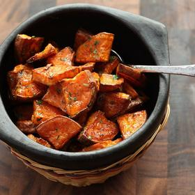

# [Roasted Sweet Potatoes](https://www.seriouseats.com/the-best-roasted-sweet-potatoes-thanksgiving-sides-the-food-lab-recipe)
> **tags**: #To Try #0star

## Description

## Ingredients

- 3 pounds (1.4kg) peeled or skin-on sweet potatoes, quartered, and cut into 1/2-inch slices
- 6 tablespoons (90ml) extra-virgin olive oil, divided
- Kosher salt and freshly ground black pepper
- 2 tablespoons chopped fresh parsley leaves
- 1 tablespoon (15ml) honey, maple syrup, or agave nectar

## Directions
Place sweet potatoes in a large saucepan and cover with water. Heat water to 160°F (71°C) as registered on an instant-read thermometer. Cover and set aside for 1 hour.

Meanwhile, adjust oven racks to upper middle and lower middle positions and preheat oven to 400°F (200°C). Drain sweet potatoes and transfer to a large bowl. Toss with 3 tablespoons olive oil and season to taste with salt and pepper. Spread sweet potatoes on 2 rimmed baking sheets and roast until bottom side is browned, about 30 minutes. Carefully flip potatoes with thin offset spatula and roast until second side is browned and potatoes are tender, about 20 minutes longer.

Transfer to a large bowl. Toss with remaining 3 tablespoons olive oil, parsley, and honey (or maple syrup or agave nectar, if using). Serve immediately.

## Notes

## Data
**prep** 5 mins | **cook** 55 mins | **total**  | **serves** 6 to 8 servings