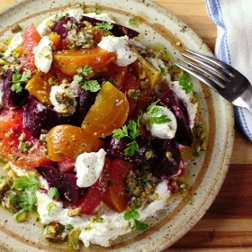

# [Roasted-Beet and Citrus Salad with Ricotta and Pistachio Vinaigrette](https://www.seriouseats.com/roasted-beet-pistachio-ricotta-grapefruit-citrus-salad-recipe)
> **tags**: # #0star

## Description

## Ingredients

- 2 pounds (about 1kg) beets, unpeeled, greens removed, scrubbed clean
- 1/4 cup (60ml) extra-virgin olive oil, divided
- 2 sprigs thyme or rosemary (optional)
- Kosher salt and freshly ground black pepper
- 1/4 cup toasted shelled pistachios (about 2 ounces; 55g)
- 1 grapefruit, cut into suprèmes or wedges, 1 tablespoon (15ml) juice reserved separately
- 1 orange, cut into suprèmes or wedges, 1 tablespoon (15ml) juice reserved separately
- 2 teaspoons (10ml) juice from 1 lemon
- 1 small shallot, finely minced (about 1 ounce; 30g)
- 2 tablespoons (about 15g) minced fresh parsley, tarragon, or chervil
- 1 tablespoon (15ml) honey
- 1 cup (200g) fresh ricotta

## Directions
Preheat oven to 375°F (190°C). Fold a 12- by 24-inch sheet of aluminum foil in half to form a square. Crimp 2 edges to form a pouch. Toss beets, 1 tablespoon (15ml) olive oil, thyme or rosemary sprigs (if using), and salt and pepper to taste in a medium bowl until beets are coated. Add to pouch and crimp remaining edge to seal. (If using multiple colors of beets, roast in separate pouches.) Transfer to a rimmed baking sheet and place in oven. Roast until beets are completely tender and a toothpick or cake tester inserted into a beet through foil meets little to no resistance, about 1 1/2 hours. Remove from oven and allow to cool. When beets are cool enough to handle, peel by gently rubbing skin under cold running water. Cut beets into 1 1/2–inch chunks. Beets can be cooked and stored in the refrigerator for up to 5 days.

Place pistachios in a mortar and pound with pestle until lightly crushed but not totally pulverized. (You can also chop them with a knife.) Transfer half of nuts to a large bowl and reserve the rest for garnish.

Add grapefruit juice, orange juice, lemon juice, shallot, minced herbs, and honey to bowl with pistachios and whisk to combine. Drizzle in remaining 3 tablespoons (45ml) olive oil while whisking constantly. Season to taste with salt and pepper.

To Serve: Toss beets and citrus with vinaigrette in a large bowl (if using red beets, toss them separately from everything else) and season to taste with salt and pepper. Spread half of ricotta over a serving platter, place dressed beets and citrus on top, dollop with remaining ricotta, sprinkle with reserved pistachios, and serve.

## Notes

## Data
**prep** 15 mins | **cook** 105 mins | **total**  | **serves** 4 to 6 servings