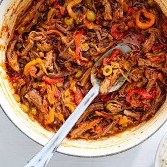

# [Ropa Vieja](https://cooking.nytimes.com/recipes/1021457-ropa-vieja)
> **tags**: #Mexican #0star

## Description

## Ingredients

- 2 pounds beef flank steak or sirloin flap, cut crosswise into 3- to 4-inch sections, or pork butt, cut into 3- to 4-inch steaks against the grain
- Kosher salt and black pepper
- 1 tablespoon grapeseed, vegetable or canola oil
- 1 recipe Braised Peppers and Onions (about 3 cups)
- 1 (15-ounce) can crushed tomatoes or whole peeled tomatoes, crushed by hand
- 1/2 cup Manzanilla olives, sliced crosswise
- 1/2 cup golden raisins
- 1/4 cup capers, drained
- 2 cups homemade or store-bought low-sodium chicken stock
- Cooked white rice, black beans and sautéed or braised hearty greens, for serving

## Directions
Season beef or pork with salt and pepper. Heat oil in a large Dutch oven over high until lightly smoking. Working in batches as needed, cook the meat in a single layer, turning occasionally, until well browned on all sides, about 8 minutes per batch, reducing heat as necessary if the oil smokes excessively.

Add braised peppers and onions, tomatoes, olives, raisins, capers and chicken stock. Scrape up any browned bits from the bottom of the pot. Bring to a boil, reduce to a bare simmer, cover with the lid slightly cracked, and cook, stirring occasionally and scraping any crust that has formed at the edges of the pan back into the liquid, until meat is completely tender and shreds easily with two forks, about 2 1/2 hours. Season to taste with salt and pepper.

Shred meat with two forks, and serve immediately with white rice, black beans and hearty greens. Ropa vieja can also be shredded, allowed to cool, and stored in the fridge for up to 1 week. It will improve in texture and flavor with time.

## Notes

## Data
**prep**  | **cook**  | **total** 3 hr | **serves** 6 cups (4 servings)