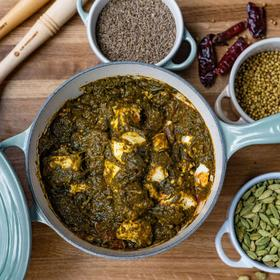

# [Saag Paneer](https://www.lecreuset.com/saag-paneer/LCR-2676.html)
> **tags**: #Indian #0star

## Description

## Ingredients

- Salt
- 3 1/2 pounds baby spinach, divided
- 1/2 cup canola oil
- 4 tablespoons unsalted butter
- 1 1/2 teaspoon cumin seeds
- 3/4 cup sliced red onion
- 3 large cloves garlic, minced
- 1/2 cup chopped tomatoes
- 5 teaspoons red chili powder
- 2 1/2 teaspoons garam masala spice blend
- 5 teaspoons ground coriander
- 14-16 ounces paneer, cut into 1-inch pieces
- 1-inch fresh ginger, peeled and julienned

## Directions
Bring a large pot of water to a boil. Add a tablespoon of salt to the water. Add half of the spinach and blanch for 1 minute. Remove the spinach and place in a colander to drain. Once cool, roughly puree the spinach in a food processor and set aside. Shred the remaining raw spinach and place in a separate bowl.

Heat the oil and butter in a large saucepan over medium heat. Add the cumin seeds and cook until they start crackling, about 2 minutes. Add the onion and garlic. Cook until the onions are softened and brown, about 10 minutes. Add the tomatoes and cook until mashed, about 5 minutes longer.

Add the red chili powder, garam masala and the blanched spinach along with a pinch of salt. Cook, stirring frequently, for 10 minutes. Add the shredded raw spinach and toss together until it wilts and sweats, about 2 minutes.

Add the coriander and paneer and cook for 1 minute. Add the julienned ginger and toss to serve.

## Notes

## Data
**prep**  | **cook** 35 minutes | **total**  | **serves** 4