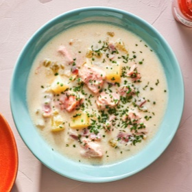

# [Salmon Chowder, One Pot](https://www.seriouseats.com/easy-creamy-one-pot-weeknight-salmon-chowder-recipe)
> **tags**: #Soup #0star

## Description

## Ingredients

- 1/2 pound salt pork or bacon, cut into 1/2-inch pieces (225g)
- 2 tablespoons water (30ml)
- 1 medium onion, finely chopped (about 8 ounces; 225g)
- 2 large ribs celery, finely chopped (about 6 ounces; 170g)
- Kosher salt and freshly ground black pepper
- 2 tablespoons all-purpose flour (about 20g)
- 1 cup bottled clam juice (235ml)
- 1 quart whole milk (900ml)
- 1 pound russet or Yukon Gold potatoes, peeled and cut into 1/2-inch cubes (450g)
- 1 bay leaf
- 3/4 to 1 pound boneless, skinless fish scraps, such as salmon, cod, or halibut, cut into 3/4-inch chunks (350-450g)
- Minced fresh herbs such as parsley, dill, or chives, for serving
- Hot sauce, for serving
- Crackers, for serving

## Directions
Combine salt pork or bacon and water in a heavy-bottomed stock pot or Dutch oven over medium heat and cook, stirring occasionally, until water has evaporated and pork has begun to brown and crisp in spots, about 8 minutes. Add onion and celery. Season gently with salt and pepper and continue to cook, stirring occasionally, until onions are softened but not browned, about 4 minutes longer. Add flour and cook, stirring, until no pockets of raw flour remain. Stir in clam juice, followed by milk. Add potatoes and bay leaf and bring to a simmer.

Simmer chowder, stirring occasionally, until potatoes are fully tender, about 15 minutes. Stir in fish chunks and simmer just until cooked through, about 3 minutes. Season to taste with salt and pepper.

Serve immediately, garnish with minced fresh herbs, hot sauce, and crackers.

## Notes

## Data
**prep**  | **cook** 40 mins | **total**  | **serves** 4 to 6 servings