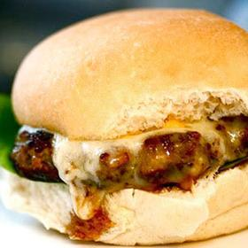

# [Seriously Meaty Turkey Burgers](https://www.seriouseats.com/seriously-meaty-turkey-burgers-recipe)
> **tags**: #To Try #0star

## Description

## Ingredients

- 1 small eggplant, about 6-8 ounces
- 1 teaspoon olive oil
- Salt
- Freshly ground black pepper
- 1 teaspoon soy sauce
- 1 anchovy filet, mashed to a paste (or 1 teaspoon anchovy paste)
- 1/4 teaspoon marmite
- 1 pound boneless, skinless turkey thighs, cut into 1-inch cubes

## Directions
Preheat oven to 400°F (200°C) and set rack to upper-middle position. Rub eggplant with olive oil until coated. Season with salt and pepper. Wrap with aluminum foil and set on rimmed baking sheet. Roast until completely tender, turning once, about 30 minutes. Allow to cool slightly, remove from foil, and scrape flesh away from skin. Chop flesh until fine purée is formed. There should be about 4-6 ounces of purée.

Combine soy sauce, anchovies, and marmite in small bowl with back of fork until homogenous and marmite is completely dissolved and anchovies are smooth. Toss meat with anchovies/soy/marmite mixture until thoroughly coated (if using pre-ground turkey, mix together by hand until homogeneous). Place feed shaft, blade, and 1/4-inch die of meat grinder in freezer until well-chilled. Meanwhile, place meat chunks on rimmed baking sheet, leaving space between each piece and place in freezer for 10 minutes until meat is firm, but not frozen.

Pass meat through grinder. Combine with eggplant purée. Form into 4 patties. At this point, follow your favorite burger recipe to cook the patties, making sure to cook them to at least 150°F (66°C).

## Notes

## Data
**prep** 20 mins | **cook** 45 mins | **total**  | **serves** 4 burgers