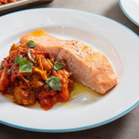

# [Sheet-Pan Salmon with Tomato-Eggplant Compote](https://www.seriouseats.com/sheet-pan-salmon-with-tomato-eggplant-compote)
> **tags**: #Fish #Steph #5star

## Description

## Ingredients

- 1 1/2 pounds (675g) grape or cherry tomatoes
- 1/4 cup (60ml) extra-virgin olive oil, plus more for drizzling
- Kosher salt
- 4 medium cloves garlic, sliced
- 1 pound (450g) eggplant (about 1 medium globe or 2 large Asian eggplants), cut into 1/2-inch dice
- 2 tablespoons (30ml) gochujang (Korean chile paste)
- Four 6-ounce (170g) skinless salmon fillets
- Fresh basil leaves, torn, for garnish
- Freshly ground black pepper

## Directions
Adjust oven rack to middle position and preheat oven to 450°F (232°C). On a rimmed baking sheet, toss tomatoes with olive oil and season with salt. Transfer to oven and roast, shaking sheet tray once or twice, until tomatoes just start to split, about 10 minutes. Add garlic to middle of sheet tray, stirring to lightly coat in oil, then roast until garlic is fragrant and tomatoes have softened more, about 5 minutes.

Using a wooden spoon, carefully crush the softest tomatoes.

Push garlic and tomatoes to one side of the sheet tray. Add eggplant to the empty half, drizzle lightly with olive oil, and season eggplant with salt. Return to oven and cook, stirring once or twice, until eggplant is beginning to soften, about 10 minutes; if tomatoes and garlic threaten to scorch, add a little water to the hot spots to prevent it.

Stir together eggplant and tomato mixture, bursting more tomatoes if possible. Stir in gochujang until well incorporated. Return to oven and continue to cook, stirring occasionally, until eggplant is very soft, about 20 minutes; add a few tablespoons of water at any point if mixture seems dry or at risk of scorching, especially around the edges and corners of the baking sheet.

Push the tomato-eggplant mixture to one side of the baking sheet, scraping well to clear space for salmon. Lay down a sheet of foil just large enough to cover the cleared area and lightly grease with oil. Season salmon all over with salt, then place on prepared foil. Cook until salmon registers 115 to 125°F (46 to 52°C) in the center of the thickest part for medium-rare to medium, 6 to 10 minutes.

If tomato-eggplant mixture is too thick and dry, loosen by stirring in 1 or 2 tablespoons water at a time until desired consistency is reached. Season with salt, if needed. Using a thin metal spatula, transfer salmon to plates. Scoop tomato-eggplant compote alongside. Garnish with torn basil leaves, drizzle with fresh olive oil, and finish with some freshly ground black pepper. Serve.

## Notes

## Data
**prep**  | **cook** 60 mins | **total**  | **serves** 4 servings