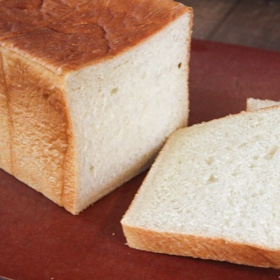

# [Shokupan](https://www.dreamsofdashi.com/2023/01/shokupan.html?m=1)
> **tags**: #To Try #0star

## Description

## Ingredients

- 330g bread flour
- 24g sugar
- 14g dry milk
- 7g salt
- 4g instant yeast (I like the SAF brand, should be about 1 tsp)
- 20g bread flour (for tangzhong)
- 100g water (for tangzhong)
- 95g lukewarm water
- 1 large egg (should be close to 50g)
- 20g butter
- Extra butter and flour for greasing and bench flour

## Directions
Measure out and mix all dry ingredients in the stand mixer bowl

Make the tangzhong by whisking the flour into the water completely in a small pot. Heat up the mixture on medium low heat and continuously stir being careful to get the edges as well until the water roux thickens up to a pudding consistency. When you take a spatula to it you should be able to see the bottom of the pot

Add all of the wet ingredients except for the butter and mix with the dough hook on medium (setting 4 if on Kitchen Aid stand mixer) for 5 minutes. It will look really dry in the beginning but it should come together by the 5 minute mark

Add pads of room temperature butter and let the mixer go for another 10-12 minutes on the medium setting. The dough will temporarily come apart but the butter will eventually be kneaded in and the dough will come together. The dough should be slightly tacky when done

Shape the dough into a ball with your hands and place in a greased bowl.

Cover with plastic film and let it proof for an hour or so in a warm place until the dough has doubled in size (time will depend on the temperature, ideal temp is around 75-85°F)

Punch down the dough, cut it into two equal pieces and roll into balls again

Let the dough bench rest for 20 minutes covered by plastic film or a towel

Roll out each ball of dough in an ellipse and fold into thirds vertically. Roll out the dough again into a long ellipse and roll up (perpendicular to the direction you folded the dough into thirds). Pinch the ends into the dough to secure tightly

Place both rolls of dough into a greased loaf pan with the stitched end side down and cover with plastic film for second proofing. It should take anywhere from 40 minutes to an hour for the rolls to expand to the height of the loaf pan and cover all gaps. If the loaf pan is less than 4 inches in height, proof past the height of the pan.

Bake the loaf at 350°F for 35 minutes. The bread should be golden brown and have a hard crust

Remove the bread from the loaf pan and let it cool on a rack so that the bread doesn't continue to steam itself

## Notes

## Data
**prep** 2 hours 30 mins | **cook** 35 mins | **total**  | **serves** Serves: 1 loaf