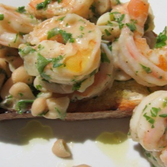

# [Shrimp Scampi](https://www.seriouseats.com/grilled-garlic-bread-white-bean-shrimp-scampi)
> **tags**: #Fish #0star

## Description

## Ingredients

- 4 extra thick slices of excellent crusty, rustic round bread
- 2 tablespoons of olive oil plus extra for drizzling
- 10 cloves garlic, sliced or chopped, plus 1 whole clove
- Kosher salt and freshly ground black pepper
- 1 pound thawed frozen peeled and deveined large shrimp
- A pinch of chili flakes
- 1/2 cup dry white wine, such as Pinot Grigio
- 1 (15-ounce) can of cannellini beans, drained and rinsed
- 2 tablespoons cold unsalted butter, diced
- 1/2 cup fresh flat leaf parsley, roughly chopped
- A handful of torn baby arugula (optional)

## Directions
Heat a grill pan over high heat or the oven to 450°F. Drizzle the bread lightly with olive oil on both sides, and grill or toast on both sides. Cut the whole garlic clove in half. When the bread is toasted, rub the hot bread all over with the cut side of the garlic, and season lightly with salt.

In a large braising pan, head 2 tablespoons of olive oil over medium-high heat. Add the shrimp, and season with the chili flakes, salt and pepper. Cook just until the shrimp are pink and curled, turning once. Set the shrimp aside with a slotted spoon. Add the garlic to the hot oil, and just heat through until you can smell it—less than 30 seconds. Add the wine and beans and bring to a boil. Gently whisk in the cold butter and parsley. Add the shrimp back in to the sauce, and spoon over the waiting garlic bread. If you want to be extra gourmet, add in a heaping handful of torn baby arugula. Bon app!

## Notes

## Data
**prep**  | **cook** 10 mins | **total**  | **serves** 2 servings