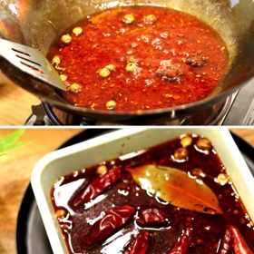

# [Sichuan Hot Pot Base](https://sichuankitchenrecipes.com/2022/12/23/sichuan-hot-pot-base/)
> **tags**: # #0star

## Description

## Ingredients

- 100 g dry chili about 4 cup
- 3 tbsp Sichuan peppercorn
- 4 tbsp Shaoxing wine
- 500 g beef tallow
- 1 star anise
- 2 small pieces cassia cinnamon
- 2 bay leaves
- 1 Chinese black cardamom
- 10 White cardamom
- 5 g Fennel seeds
- 1/2 onion sliced
- 5 scallions cut into sections
- 1 handful cilantro
- 1 large piece ginger (sliced)
- 50 g Sichuan chilli bean paste about 1/2 cup
- 1 tbsp fermented black beans rinsed
- 1 tbsp rock sugar

## Directions
Prepare about 100g of dry chili. Take out about 9 chilies for garnish later. Cut the chilies into sections and shake out the seeds. The purpose of this step is to release the seeds so the hot pot base is not too spicy. You can use a strainer to shake out even more seeds from the peppers.

Add boiling hot water to the chilies. Soak for 20 - 30 minutes.

While waiting, prepare the aromatics. Wash the cilantro to remove any dirt. Cut in half. Slice one large piece of peeled ginger. Slice half an onion. Chop green onion into sections.

Prepare and measure other ingredients

Drain the chilies. Add to a food processor. Blend until they become a coarse paste. You can also chop up the chilies with a knife or use a mortar and pestle.

Add shaoxing wine to the spice mix and Sichuan peppercorn. Mix well so everything is covered by the liquid. The purpose of shaoxing wine is to release the flavor of spices and prevent overcooking.

Add beef tallow to a wok or large pot. Turn on the heat to melt tallow completely. Drop in the aromatics. Slowly fry for about 10-15 minutes until the aromatics start to brown. Take out the aromatics with a strainer. Reduce heat to low or turn off the heat during this step to prevent overheating.

Gently put in the chili paste and stir. Add in the spices. Remember to drain the cooking wine before putting them in. Cook on low heat for 10 minutes.

Add Sichuan Doubanjiang and fermented black beans. Simmer for 8 minutes while gently stirring from time to time to avoid sticking to the bottom.

Add Sichuan peppercorn and sugar. Cook for 2 more minutes.

Turn off the heat and let cool for a while.

Pour the oil, along with the solid content, into a heat resistant container. Stir to even out the mixture. Add the bayleaf and leftover dried chilies for garnishing on top.

After leaving in the fridge for 24 hours, the hot pot base is fully solidified. Cut the solidified soup base into four small blocks. You can now store the leftover soup base blocks for 2 weeks in the fridge or up to 6 months in the freezer.

## Notes

## Data
**prep** 20 mins | **cook** 30 mins | **total**  | **serves** 8