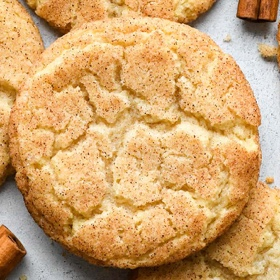

# [Snickerdoodles](https://joyfoodsunshine.com/snickerdoodle-recipe/)
> **tags**: #Dessert #0star

## Description

## Ingredients

- 1/4 cup shortening
- 1/4 cup salted butter softened
- 3/4 cup granulated sugar
- 1 egg
- 1/2 teaspoon pure vanilla extract
- 1 1/3 cups all-purpose flour sifted
- 1/4 teaspoon cinnamon
- 1 teaspoon cream of tartar
- 1/2 teaspoon baking soda
- ⅛ teaspoon sea salt
- Cinnamon Sugar Coating
- 2 Tablespoons granulated sugar
- 1 1/2 teaspoons cinnamon

## Directions
Preheat oven to 375 degrees F.

Make the Cinnamon Sugar Coating

In a small bowl, mix together 2 Tablespoons granulated sugar and 1 ½ teaspoons cinnamon. Set aside.

Make the Snickerdoodles

Sift flour into a medium bowl.

Add the cinnamon, cream of tartar, baking soda and salt to the sifted flour and stir to combine. Set aside.

Cream the butter, shortening and sugar together in the bowl of a standing mixer fitted with the paddle attachment (or with a hand mixer).

Add the egg and vanilla and beat again until smooth.

Beat in the dry ingredient mixture until just incorporated.

Use a 1 ½ tablespoon cookie scoop to measure dough, then roll it into balls.

Roll each dough ball in the cinnamon sugar mixture until it’s evenly coated.

Place the snickerdoodles on a baking sheet, either ungreased or lined with a silicone baking mat.

Bake in the preheated oven for 8-10 minutes until puffed and mostly set, but still soft.

Remove from oven and transfer to a wire cooling rack to cool.

## Notes

## Data
**prep** 5 minutes | **cook** 9 minutes | **total**  | **serves** 14 snickerdoodles