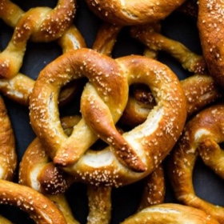

# [Soft Pretzels](https://sallysbakingaddiction.com/easy-homemade-soft-pretzels/)
> **tags**: #Quick Bread #0star

## Description

## Ingredients

- 1 and 1/2 cups (360ml) warm water (lukewarm– no need to take temperature but around 100°F (38°C) is great)
- 2 and 1/4 teaspoons (7g) instant or active dry yeast (1 standard packet)
- 1 teaspoon salt
- 1 Tablespoon brown sugar or granulated sugar
- 1 Tablespoon unsalted butter, melted and slightly cool
- 3 and 3/4-4 cups (469-500g) all-purpose flour (spooned & leveled), plus more for hands and work surface
- coarse salt or coarse sea salt for sprinkling
- Baking Soda Bath (See Recipe Note)
- 1/2 cup (120g) baking soda
- 9 cups (2.13L) water

## Directions
Whisk the yeast into warm water. Allow to sit for 1 minute. Whisk in salt, brown sugar, and melted butter. Slowly add 3 cups of flour, 1 cup at a time. Mix with a wooden spoon (or dough hook attached to stand mixer) until dough is thick. Add 3/4 cup more flour until the dough is no longer sticky. If it is still sticky, add 1/4 – 1/2 cup more, as needed. Poke the dough with your finger – if it bounces back, it is ready to knead.

Turn the dough out onto a floured surface. Knead the dough for 3 minutes and shape into a ball. Cover lightly with a towel and allow to rest for 10 minutes. (Meanwhile, I like to get the water + baking soda boiling as instructed in step 6.)

Preheat oven to 400°F (204°C). Line 2 baking sheets with parchment paper or silicone baking mats. Silicone baking mats are highly recommended over parchment paper. If using parchment paper, lightly spray with nonstick spray or grease with butter. Set aside.

With a sharp knife or pizza cutter, cut dough into 1/3 cup sections (about 75g each).

Roll the dough into a 20-22 inch rope. Form a circle with the dough by bringing the two ends together at the top of the circle. Twist the ends together. Bring the twisted ends back down towards yourself and press them down to form a pretzel shape.

Bring baking soda and 9 cups of water to a boil in a large pot. Drop 1-2 pretzels into the boiling water for 20-30 seconds. Any more than that and your pretzels will have a metallic taste. Using a slotted spatula, lift the pretzel out of the water and allow as much of the excess water to drip off. Place pretzel onto prepared baking sheet. Sprinkle each with coarse sea salt. Repeat with remaining pretzels. If desired, you can cover and refrigerate the boiled/unbaked pretzels for up to 24 hours before baking in step 7.

Bake for 12-15 minutes or until golden brown.

Remove from the oven and serve warm with spicy nacho cheese sauce.

Cover and store leftover pretzels at room temperature for up to 3 days. They lose a little softness over time. To reheat, microwave for a few seconds, or bake at 350°F (177°C) for 5 minutes.

## Notes
Make Ahead & Freezing Instructions: Baked and cooled pretzels freeze well for up to 3 months. To reheat, bake frozen pretzels at 350°F (177°C) for 20 minutes or until warmed through or microwave frozen pretzels until warm. The prepared pretzel dough can be covered and refrigerated for up to one day or frozen in an airtight container for 2-3 months. Thaw frozen dough in the refrigerator overnight. Refrigerated dough can be shaped into pretzels while still cold, but allow some extra time, about 1 hour, for the pretzels to puff up before the baking soda bath and baking.

Special Tools (affiliate links): Electric Stand Mixer or Glass Mixing Bowl | Wooden Spoon | Baking Sheets | Silicone Baking Mats or Parchment Paper | Pizza Cutter

Baking Soda Bath (Step 6): The baking soda bath is strongly recommended because it helps create that chewy texture and distinctive pretzel flavor. If skipping, brush the shaped and unbaked pretzels with a mixture of 1 beaten egg + 1 Tablespoon of dairy or nondairy milk. This is known as an egg wash. Sprinkle the brushed pretzels with salt. The egg wash will help the salt stick. If you don’t have an egg, simply brush with 2 Tablespoons of dairy or nondairy milk.

Cinnamon Sugar Pretzels: Skip the coarse salt topping (and skip the egg wash, see note above, if you aren’t doing the baking soda bath step). Bake as directed in step 7. Meanwhile, melt 4 Tablespoons (60g) of unsalted or salted butter (your choice). Brush the baked and warm pretzels with melted butter then dip the tops into a mix of cinnamon and sugar. I usually use 3/4 cup (150g) of granulated sugar and 1 and 1/2 teaspoons cinnamon. Cinnamon sugar pretzels are best served that day because due to the melted butter topping, they become soggy after a few hours.

## Data
**prep** 25 min | **cook** 25 minutes | **total**  | **serves** Yield: 12 pretzels