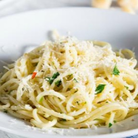

# [Spaghetti Aglio E Olio](https://www.foodnetwork.com/recipes/food-network-kitchen/spaghetti-with-oil-and-garlic-aglio-et-olio-recipe-1944538)
> **tags**: #Easy #4star

## Description

## Ingredients

- salt
- 1 pound spaghetti
- 3 cloves garlic, minced
- 1/2 cup extra-virgin olive oil
- Pinch red pepper flakes
- 2 tablespoons chopped flat-leaf parsley
- 1/2 lemon, zested, optional
- Freshly grated Parmigiano-Reggiano, optional

## Directions
Bring a large pot of cold water to a boil over high heat, then salt it generously. Add the pasta and cook, stirring occasionally until al dente, tender but not mushy, about 8 minutes.

While the pasta cooks, combine the garlic, olive oil, 1 teaspoon salt and the red pepper flakes in a large skillet and warm over low heat, stirring occasionally, until the garlic softens and turns golden, about 8 minutes.

Drain the pasta in a colander set in the sink, reserving about a 1/4 cup of the cooking water. Add the pasta and the reserved water to the garlic mixture. Mix well. Add the parsley and lemon zest (if using). Adjust seasoning, to taste. Transfer to a large serving bowl or divide amongst 4 to 6 dishes. Serve topped with grated cheese, if desired.

## Notes

## Data
**prep** 16 min | **cook** 26 min | **total**  | **serves** Yield: 4 to 6 servings