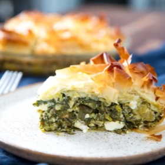

# [Spanakopita](https://www.seriouseats.com/spanakopita-greek-savory-greens-pie)
> **tags**: #To Try #0star

## Description

## Ingredients

- 8 cups chopped mixed greens and tender stems, gently packed (about 12 1/2 ounces; 350g), such as spinach, watercress, arugula, and Swiss chard (see note)
- 1 cup chopped mixed tender herbs and tender stems (about 2 ounces; 60g), such as dill, parsley, chervil, and chives
- 1/4 cup extra-virgin olive oil (2 ounces; 50g), plus more
- 1 1/2 teaspoons (6g) kosher salt
- 1/2 teaspoon freshly ground black pepper
- 3 sliced scallions, both white and green parts (about 2 ounces; 60g)
- 2 cloves garlic (10g), sliced
- 2/3 cup trahanas (3 ounces; 90g); rice, barley, or couscous can substitute (see note)
- 1 large egg
- 1/2 pound (226g) Greek feta, crumbled
- 6 sheets phyllo dough, thawed

## Directions
Getting Started: Adjust oven rack to lower-middle position. Preheat oven to 400°F (200°C). Brush a 9-inch glass pie plate (either deep-dish or standard size will work with this recipe) generously with olive oil and set on a parchment-lined rimmed baking sheet.

For the Filling: In a large bowl, combine chopped greens, chopped herbs, 1/4 cup olive oil, salt, and black pepper. Massage together to gently wilt the greens, then set aside.

In a small sauté pan over medium heat, add 1 tablespoon olive oil, scallions, and garlic and cook until wilted, about 5 minutes. Add the hot mixture to the greens and combine to further wilt the vegetables. Add the trahanas (or your substitute of choice) and egg and thoroughly combine. Once everything is well mixed, fold in the crumbled feta.

To Assemble the Pie: Unroll thawed phyllo and keep it covered with a moist kitchen towel while working. Working with 1 sheet at a time, lay phyllo so that it is centered in the pie pan with the excess draping over the rim and brush generously with about 1 tablespoon olive oil. Repeat with 3 more sheets of phyllo, each sheet placed perpendicular to the previous one, brushing with olive oil before adding the next.

Add greens mixture to phyllo-lined pie. Fold excess phyllo over greens and drape remaining 2 sheets of phyllo over the top. Drizzle with more olive oil. Slice into portions using a serrated knife. Bake in preheated oven until golden brown, about 45 minutes. Allow to cool at least 15 minutes before serving.

## Notes

## Data
**prep** 10 mins | **cook** 50 mins | **total**  | **serves** 8 servings