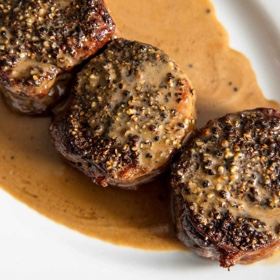

# [Steak Au Poivre](https://www.seriouseats.com/steak-au-poivre)
> **tags**: #Dinner #0star

## Description

## Ingredients

- 4 (6- to 8-ounce; 170 to 225g) boneless medallion steaks, such as filet mignon
- Kosher salt
- 1 ounce (30g) whole black peppercorns, plus more as needed, divided
- 3 tablespoons (45ml) vegetable oil
- 1 tablespoon (15g) unsalted butter
- 2 thyme sprigs
- 1 medium garlic clove
- 1/2 large shallot (about 1 1/2 ounces; 40g), minced
- 2 tablespoons (30ml) brandy or cognac
- 3/4 cup (175ml) homemade chicken stock or store-bought low-sodium chicken broth
- 3/4 cup (175ml) heavy cream or 6 tablespoons (90ml) crème fraîche (see note)
- 1 teaspoon (5ml) Dijon mustard

## Directions
Season steaks all over with kosher salt. Set on a wire rack set over a rimmed baking sheet and allow to air-dry, uncovered, in the refrigerator for 30 minutes.

Meanwhile, crack peppercorns into rough halves and quarters. You can use a pepper mill set to its coarsest setting (though not all pepper mills will crack coarsely enough); a mortar and pestle (though some peppercorns will jump out as you try to crush them); or, perhaps best, a large mallet, meat pounder, or skillet to crush them (wrap the peppercorns in a clean kitchen towel first to contain them).

Preheat oven to 375°F (190°C). Spread cracked peppercorns on a plate or in another shallow dish and firmly press one side of each steak into the pepper to encrust it in an even layer. Set each steak aside, peppercorn side up. Reserve any remaining cracked peppercorns. (Exactly how much pepper adheres will depend on the dimensions of the steaks. You should have some pepper remaining, but if not, you can crack more to completely coat one side of each steak.)

In a large stainless steel or cast iron skillet, heat oil over medium-high heat until shimmering. Add steaks, peppercorn side down, and cook until peppercorns are well toasted, about 3 minutes. Carefully turn steaks, trying not to break the peppercorn crust. Add butter, thyme, and garlic and cook, basting steaks with a spoon, until steaks are well seared on the second side. Remove from heat.

Transfer steaks to a rimmed baking sheet. Using an instant-read thermometer, check the internal temperature of the steaks; if they've reached 125°F (52°C), they're ready to be served medium-rare. If they haven't reached their final doneness temperature (which will depend heavily on the dimensions of the steaks), transfer to oven and continue cooking until the correct internal temperature is reached. Either way, allow steaks to rest for 5 minutes once the final doneness temperature is reached.

Pour off all but 1 tablespoon of fat from skillet and discard garlic and thyme. Add shallot and any reserved cracked peppercorns, return to medium heat, and cook, stirring, until shallot is tender, about 2 minutes.

Add brandy or cognac. (To prevent an unexpected flare-up if working over gas, you can turn off the burner, add the alcohol, then reignite the burner.) Cook until raw alcohol smell has burned off and brandy has almost completely evaporated.

Add chicken stock and bring to a simmer, stirring and scraping up any browned bits. Whisk in cream or crème fraîche, then simmer, stirring often, until sauce has reduced enough to glaze a spoon. Whisk in mustard. Season with salt.

Arrange steaks on plates and pour sauce on top. Serve with French fries, mashed potatoes, or other sides of your liking.

## Notes
Heavy cream makes a more delicate, sweeter sauce that better showcases the peppercorn flavor, while crème fraîche adds a layer of tangy complexity to the sauce. Both work well!

## Data
**prep** 15 mins | **cook** 30 mins | **total**  | **serves** 4 servings