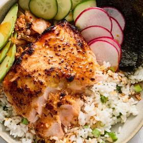

# [Sticky Miso Salmon Bowl](https://cooking.nytimes.com/recipes/1025510-sticky-miso-salmon-bowl)
> **tags**: # #0star

## Description

## Ingredients

- 2 cups sushi rice
- 3 tablespoons white miso
- 2 tablespoons honey
- 1 tablespoon vegetable oil
- 1 tablespoon freshly grated ginger
- 2 teaspoons fresh grapefruit zest plus 1 tablespoon juice
- 4 (6- to 8-ounce) skinless salmon fillets, patted dry
- Salt and pepper
- 4 scallions, thinly sliced
- 1 tablespoon unsalted butter, cubed
- Any combination of kimchi, chile crisp, toasted nori sheets, and sliced cucumber, avocado or radish, for serving

## Directions
Put the rice in a medium bowl and fill with cool tap water. Run your fingers through the rice, gently swooshing the grains around to loosen the starch. Dump out as much water as you can and repeat until the water runs slightly more clear, another two to three rinses.

Drain the rice and transfer to a small or medium saucepan that has a tight-fitting lid. Pour in 2 1/4 cups cool water and bring to a boil over medium-high. Give the rice a stir to help keep it from sticking to the bottom of the pot, then cover and decrease heat to low. Cook without lifting the lid for 18 minutes. (Set your timer!)

While the rice is cooking, place a rack about 5 inches from the broiler heat source and set the broiler to high. Whisk the miso, honey, oil, ginger and grapefruit zest and juice in a large bowl. Season the salmon lightly with salt and add to the bowl. Gently toss to coat. Marinate at room temperature until the timer for the rice goes off.

Remove the pot of rice from the heat and let steam, covered, for 10 minutes, while you cook the salmon.

Using tongs, arrange the salmon on a foil-lined rimmed sheet tray. Make sure to leave the marinade on and spread any excess on top of the fillets. (This step will make for better browning.) Broil the salmon until glossy and charred in most spots, about 5 minutes for medium-rare or 7 minutes for medium. Your timing will also depend on whether or not you'd like a little char on top.

Uncover the rice and add the scallions and butter. Season with salt and several grinds of pepper. Fluff the rice with a rubber spatula until each grain is coated. Serve the salmon over the rice and add any of the toppings you desire.

## Notes

## Data
**prep** 10 min | **cook** 25 min | **total** 35 min | **serves** 4 servings