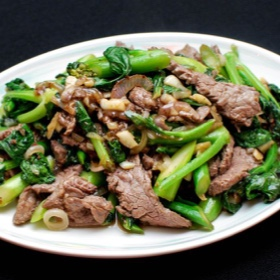

# [Stir-Fried Beef with Chinese Broccoli](https://www.seriouseats.com/stir-fry-beef-with-broccoli-gai-lan-easy-recipe)
> **tags**: #Asian #5star

## Description

## Ingredients

### For the Beef and Marinade
- 3/4 pound beef flank steak, sliced across the grain 1/8 inch thick
- 1/2 teaspoon soy sauce
- 1/2 teaspoon Shaoxing wine
- 2 teaspoons vegetable or canola oil
- 1/2 teaspoon cornstarch
- 1/2 teaspoon kosher salt
- 1/4 teaspoon sugar
- 1/4 teaspoon ground white pepper

### For the Sauce
- 2 tablespoons water
- 1 teaspoon sesame oil
- 2 teaspoons oyster sauce
- 1 teaspoon soy sauce
- 1 teaspoon cornstarch

### For the Stir-Fry
- 1/2 pound Chinese broccoli (gai lan or baby gai lan), cut into 3 sections on the diagonal if regular gai lan or in half on the diagonal if baby gai lan
- 2 tablespoons vegetable or canola oil, divided
- 2 whole shallots, sliced
- 8 cloves of garlic, chopped very coarsely
- Cooked white rice, for serving

## Directions
For the Beef and Marinade: In a medium bowl, combine beef with all marinade ingredients. Mix well and let stand 30 minutes.

Meanwhile, For the Sauce: In a small bowl, combine sauce ingredients and set aside.

For the Stir-Fry: Fill a wok halfway with water, season with salt, and bring to a boil. Add Chinese broccoli and cook until crisp-tender, about 1 minute for regular gai lan and 30 seconds for baby gai lan. Drain and set aside.

Wipe wok dry, then return to heat. Add 1 tablespoon oil and heat over high heat until smoking. Add beef, spreading it out in an even layer with a spatula, and cook without moving until lightly browned on bottom, about 1 minute. Continue to cook while stirring regularly until about halfway cooked through, about 2 minutes longer. Transfer to a bowl and set aside.

Add remaining 1 tablespoon oil to wok and heat over high heat until smoking. Add shallots and garlic and cook, stirring constantly, until softened, about 1 minute. Add Chinese broccoli and cook, stirring frequently, for 1 minute. Season with salt.

Return beef to wok and toss to combine. Stir sauce to combine, then pour into center of wok; stir to combine. Continue to cook, stirring, until the sauce begins to thicken, about 1 minute. Transfer to a serving platter immediately and serve with white rice.

## Notes
When shopping for Chinese broccoli, look for bright green, bruise-free, crisp leaves with no yellow spots. The tiny flower buds should be tight and compact. Also check the ends of the stalks and make sure they are not dry or crusted.

## Data
**prep** 5 mins | **cook** 20 mins | **total**  | **serves** 2 to 4 servings