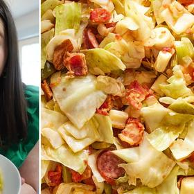

# [Swamp Cabbage](https://www.southernliving.com/swamp-cabbage-8411173)
> **tags**: #Cajun #0star

## Description

## Ingredients

- 8 oz. thick-cut hickory-smoked bacon, chopped (6 to 7 slices)
- 5 1/2 oz. hickory-smoked sausage, sliced into 1/2-in.-thick pieces (about 1 cup) (such as Conecuh)
- 1 small (6 oz.) green bell pepper, chopped (about 1 cup)
- 1 small (8 oz.) yellow onion, chopped (about 1 cup)
- 2 large (1 oz. each) celery stalks, chopped (about 1/2 cup)
- 8 cups chopped cabbage (from 1 [2-lb.] head cabbage)
- 1 (14-oz.) can hearts of palm, drained and sliced
- 1 (14 1/2-oz.) can diced tomatoes
- 1/4 cup tap water
- 1 1/4 tsp. all-purpose seasoning (such as Everglades)

## Directions
Cook bacon:

Cook bacon in a large Dutch oven over medium-high, stirring occasionally, until fat is rendered and bacon is slightly crisp on edges, about 5 minutes.

FRED HARDY, FOOD STYLIST: EMILY NABORS HALL, PROP STYLIST: CHRISTINA DALEY

Cook sausage:

Add sausage, and cook, stirring occasionally, until lightly browned and bacon is crisp, 2 to 3 minutes.

FRED HARDY, FOOD STYLIST: EMILY NABORS HALL, PROP STYLIST: CHRISTINA DALEY

Add vegetables:

Add bell pepper, onion, and celery; cook, stirring often, until slightly softened, about 4 minutes.

FRED HARDY, FOOD STYLIST: EMILY NABORS HALL, PROP STYLIST: CHRISTINA DALEY

Add cabbage, hearts of palm, and tomatoes:

Stir in cabbage, hearts of palm, tomatoes, water, and seasoning; bring to a simmer over medium-high.

FRED HARDY, FOOD STYLIST: EMILY NABORS HALL, PROP STYLIST: CHRISTINA DALEY

Cover, and cook, stirring occasionally, until cabbage is cooked through and tender, about 10 minutes.

## Notes

## Data
**prep** 15 mins | **cook** 35 mins | **total**  | **serves** 6