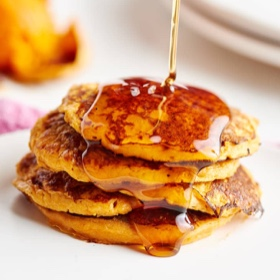

# [Sweet Potato Pancakes, 2 ingredient](https://www.thekitchn.com/sweet-potato-pancakes-259059)
> **tags**: #Charlie #4star

## Description

## Ingredients

- 1 sweet potato, baked and cooled (about 8 ounces of baked sweet potato)
- 2 eggs
- 1/8 teaspoon salt
- Pinch of ground cinnamon, optional

## Directions
Combine the sweet potato, eggs, salt, and cinnamon, if using, in a small blender or food processor and blend until smooth. Alternatively, you can stir the ingredients together in a small bowl with a spoon, but some sweet potato chunks may remain. Set the batter aside to rest while you heat the pan.

Heat an 8-inch nonstick or cast iron skillet over medium-high. Add 1/4 cup of the batter and cook for 3 minutes — this batter won’t bubble up like traditional pancake batter. Gently flip the pancake with a thin spatula and cook for an additional 3 minutes on the second side.

Repeat with remaining batter and serve warm.

## Notes

## Data
**prep**  | **cook**  | **total**  | **serves** 1