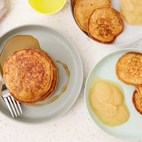

# [Sweet Potato Pancakes](https://www.yummytoddlerfood.com/whole-grain-sweet-potato-pancakes/)
> **tags**: #Charlie #Potato #0star

## Description

## Ingredients

- 1 1/4 cup flour
- 1 teaspoon cinnamon
- 1 1/2 teaspoons baking powder
- 1 1/4 cup milk
- 1/2 cup sweet potato
- 2 eggs
- 2 tablespoons butter
- 1 teaspoon vanilla

## Directions
Measure out the mashed sweet potato.

Add all ingredients to a bowl and whisk to combine.

Heat a nonstick or cast-iron pan or griddle over medium heat. Make small pancakes with batter that’s spread thinly. Flip and cook on the other side.

Add more butter and repeat to cook the rest of the pancakes. Serve warm.

Add all ingredients to a medium bowl. Whisk to combine. The batter should be pourable but thick.

Heat a nonstick or cast-iron pan or griddle over medium heat. Add a sliver of butter, let melt, and swirl to cover pan.

Add a small amount of batter, about 2 tablespoons at a time, and spread the batter thin, about ¼ inch thick or a smidge thinner. This will help ensure that they cook through. Cook for 3-4 minutes per side or until set and lightly brown. The pancakes should be mostly set and you should see little bubbles around the edges before you turn them over.

Add more butter and repeat to cook the rest of the pancakes.

Serve warm with syrup, nut butter, or yogurt.

## Notes

## Data
**prep** 10 minutes | **cook** 20 minutes | **total**  | **serves** 4