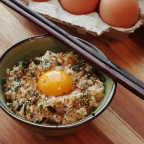

# [Tamago Kake Gohan](https://www.seriouseats.com/tamago-kake-gohan-egg-rice-tkg-recipe-breakfast)
> **tags**: #Asian #Easy #4star

## Description

## Ingredients

- 1 cup hot cooked white rice (about 12 ounces cooked rice; 340g)
- 1 large egg (plus 1 optional egg yolk)
- 1/2 teaspoon soy sauce, plus more to taste
- 1/2 teaspoon mirin (optional)
- Pinch kosher salt, plus more to taste
- Pinch MSG powder, such as Aji-no-moto or Accent (optional)
- Pinch Hondashi (optional; see notes)
- Furikake to taste (optional; see notes)
- Thinly sliced or torn nori to taste (optional)

## Directions
Place rice in a bowl and make a shallow indentation in the center. Break the whole egg into the center. Season with 1/2 teaspoon soy sauce, 1/2 teaspoon mirin (if using), a pinch of salt, a pinch of MSG (if using), and a pinch of Hondashi (if using).

Stir vigorously with chopsticks to incorporate egg; it should become pale yellow, frothy, and fluffy in texture. Taste and adjust seasonings as necessary.

Sprinkle with furikake and nori (if using), make a small indentation in the top, and add the other egg yolk (if using). Serve immediately.

## Notes

## Data
**prep** 5 mins | **cook** 5 mins | **total**  | **serves** 1 serving