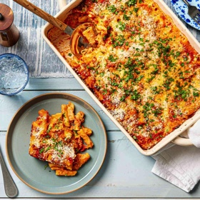

# [The Food Labs No-Boil Baked Ziti](https://www.seriouseats.com/food-lab-no-boil-baked-ziti-recipe)
> **tags**: #Italian #5star

## Description

## Ingredients

- 1 pound (454g) ziti, penne, or other thick tubular pasta
- 4 cups (950ml) homemade or high-quality store-bought red sauce (such as Rao's), divided
- 12 ounces (340g) whole-milk homemade or high-quality ricotta cheese (see notes)
- 3 ounces (85g) Parmigiano-Reggiano, finely grated and divided (about 1 1/2 cups)
- 2 large eggs, beaten
- 1 cup (240ml) heavy cream
- 3 tablespoons minced fresh flat-leaf parsley, divided
- 3 tablespoons minced fresh basil, divided
- Kosher salt and freshly ground black pepper
- 1 pound (454g) whole-milk mozzarella cheese, cut into rough 1/4-inch cubes and divided
- Cooking spray

## Directions
Adjust an oven rack to the middle position and preheat the oven to 400°F (200°C). Place ziti in a large bowl and cover with hot salted water by 3 or 4 inches. Let sit at room temperature for 30 minutes, stirring after the first 5 minutes to prevent sticking. Drain.

Pour 3 cups of the red sauce into a large pot; add ricotta, half of the Parmigiano, eggs, cream, and half of the parsley and basil, and stir to combine. Season to taste with salt and pepper. Add the soaked ziti along with half of the mozzarella cheese cubes and stir until well combined. Transfer to an ungreased 9- by 13-inch baking dish and top with the remaining 1 cup red sauce and mozzarella.

Lightly grease aluminum foil with cooking spray. Cover the baking dish tightly with the sprayed aluminum foil and bake for 45 minutes. Remove foil and bake until the cheese beginsto brown, about 15 minutes longer. Remove from oven and sprinkle with remaining Parmigiano, then let cool for 10 minutes. Sprinkle with remaining parsley and basil and serve.

## Notes

## Data
**prep** 10 mins | **cook** 60 mins | **total**  | **serves** 6 to 8 servings