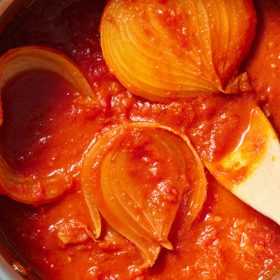

# [Tomato Sauce, Marcella Hazan](https://cooking.nytimes.com/recipes/1015178-marcella-hazans-tomato-sauce)
> **tags**: #Easy #Italian #5star

## Description

## Ingredients

- 2 cups tomatoes, in addition to their juices (for example, a 28-ounce can of San Marzano whole peeled tomatoes)
- 5 tablespoons butter
- 1 onion, peeled and cut in half
- Salt

## Directions
Combine the tomatoes, their juices, the butter and the onion halves in a saucepan. Add a pinch or two of salt.

Place over medium heat and bring to a simmer. Cook, uncovered, for about 45 minutes. Stir occasionally, mashing any large pieces of tomato with a spoon. Add salt as needed.

Discard the onion before tossing the sauce with pasta. This recipe makes enough sauce for a pound of pasta.

## Notes
I added garlic and herbs

## Data
**prep**  | **cook**  | **total** 1 hr | **serves** 4 servings