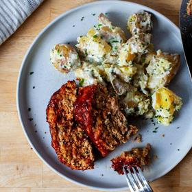

# [Turkey Meatloaf for Skeptics](https://smittenkitchen.com/2024/03/turkey-meatloaf-for-skeptics/)
> **tags**: #Mains #4star

## Description

## Ingredients

- MEATLOAF
- 1 medium yellow onion, roughly chopped
- 1 garlic clove, smashed
- 1 slim carrot, roughly chopped
- Olive oil
- Kosher salt and freshly ground black pepper
- 1/2 cup (30 grams) panko-style breadcrumbs
- 1/4 cup (60 grams) chicken broth
- 1 1/2 teaspoons tomato paste
- 1 teaspoon Dijon mustard
- 1 tablespoon (15 grams) Worcestershire sauce
- 2 tablespoons chopped fresh flat-leaf parsley
- 1 large egg
- 1 pound (455 grams) ground turkey, preferably a mix of dark and light meat, or just dark
- GLAZE
- 1 heaped (20 grams) tablespoon ketchup
- 1 tablespoon molasses
- 1 tablespoon (15 grams) apple-cider vinegar
- 1 teaspoon hot sauce of your choice (optional)
- 1 teaspoon Worcestershire sauce
- Kosher salt and freshly ground black pepper, to taste
- Kosher salt
- 1 1/2 pounds (680 grams) small red or Yukon Gold potatoes
- 1/4 cup (60 grams) heavy cream
- 1 garlic clove, minced
- 3 tablespoons (45 grams) unsalted butter, cut into pieces
- 2 scallions, finely minced (white and green parts)
- 1/3 cup (80 grams) sour cream
- 2 teaspoons white vinegar
- Freshly ground black pepper
- 2 tablespoons minced fresh flat-leaf parsley (or 1 tablespoon each parsley and dill)

## Directions
Heat the oven: To 350°F (175°C).

Prepare the meatloaf: Lightly coat a 9-by-13-inch baking dish or small sheet pan with nonstick spray. Very finely dice the onion, garlic, and carrot on a cutting board with a knife, or in a food processor. Heat a large skillet over medium heat. Once the skillet is hot, coat the bottom with olive oil, and heat it for a minute; then add the vegetables. Season with salt and pepper, and cook, stirring frequently, until they begin to brown, about 7 to 10 minutes; transfer them to a large bowl.

Add the breadcrumbs, broth, tomato paste, mustard, Worcestershire, parsley, 1 teaspoon salt, and ½ teaspoon pepper, and stir to combine. Add the egg by beating it directly into the vegetable mixture (I like to use a fork). Add the turkey, and combine just until the vegetable-egg mixture is dispersed through the meat. Pat the turkey mixture into about a 4-by-8-inch shape in your prepared pan.

Make the glaze: In a small bowl, combine the glaze ingredients. Brush or spoon the glaze over the meatloaf.

Bake: Bake the meatloaf for 30 to 35 minutes, until the internal temperature is 160°F (70°C). If you don’t have a thermometer, you can insert a knife into the center and hold it there for 10 seconds. You should feel no resistance, and when you pull it out, the blade should feel hot.

Let the meatloaf rest for 5 minutes, then cut it into 1-inch slices to serve with crushed potatoes.

In a large saucepan, cover the potatoes with cold salted water, and bring to a simmer. Cook, simmering, until the potatoes are fork-tender, about 20 minutes. Drain. You can keep the potatoes warm until they’re needed by letting them rest in the empty pot off the heat, covered with a lid, then transfer to a bowl when you’re ready to finish them.

In your emptied saucepan, heat the cream and garlic together until simmering. Keep a close eye on it to make sure it doesn’t boil over. Remove the pan from the heat, and whisk in the butter until it melts. Stir in the scallions, sour cream, and vinegar. Season well with salt (I use up to 1 teaspoon kosher salt here) and black pepper.

In a large bowl, use a fork or potato masher to smash each potato once or twice, but leave them mostly in craggy chunks. Pour the cream-garlic mixture over them, add the herbs, then season again with salt and several grinds of black pepper, and combine everything with two big folded stirs. I like these best with some pockets of the garlic cream not mixed in. Serve hot, with the meatloaf.

## Notes

## Data
**prep** 35 minutes | **cook** 25 minutes | **total**  | **serves** Servings: 4