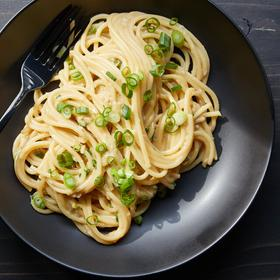

# [Vietnamese American Garlic Noodles](https://cooking.nytimes.com/recipes/1023012-san-francisco-style-vietnamese-american-garlic-noodles)
> **tags**: #Asian #Easy #Mains #Pasta #5star

## Description

## Ingredients

- 4 tablespoons unsalted butter
- 20 medium garlic cloves, minced or smashed in a mortar and pestle
- 4 teaspoons oyster sauce
- 2 teaspoons light soy sauce or shoyu
- 2 teaspoons fish sauce
- 1 pound dry spaghetti
- 1 ounce grated Parmesan or Pecorino Romano (heaping 1/4 cup)
- A small handful of thinly sliced scallions (optional)

## Directions
Melt the butter in a wok or saucepan over medium heat. Add the garlic and cook, stirring, until fragrant but not browned, about 2 minutes. Add the oyster sauce, soy sauce and fish sauce, and stir to combine. Remove from the heat.

Meanwhile, bring 1 1/2 inches of water to a boil in a 12-​inch skillet or sauté pan over high heat. (Alternatively, heat up just enough water to cover the spaghetti in a large Dutch oven or saucepan.) Add the pasta, stir a few times to make sure it’s not clumping, and cook, stirring occasionally, until just shy of al dente (about 2 minutes short of the recommended cook time on the package).

Using tongs, transfer the cooked pasta to the garlic sauce, along with whatever water clings to it. (Reserve the pasta water in the skillet.) Increase the heat to high, add the cheese to the wok, and stir with a wooden spatula or spoon and toss vigorously until the sauce is creamy and emulsified, about 30 seconds. If the sauce looks too watery, let it keep reducing. If it looks greasy, splash some more cooking water into it and let it re-​emulsify. Stir in the scallions (if using), and serve immediately.

## Notes

## Data
**prep**  | **cook**  | **total** 15 min | **serves** 4 servings