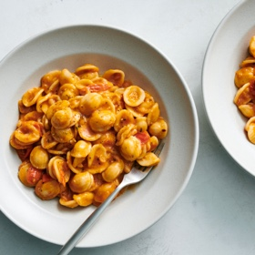

# [White Bean and Tomato Pasta](https://cooking.nytimes.com/recipes/1024062-roasted-white-bean-and-tomato-pasta)
> **tags**: #Italian #Pasta #0star

## Description

## Ingredients

- Salt and black pepper
- 3/4 cup plus 2 tablespoons extra-virgin olive oil
- 1 large shallot, finely minced
- 2 tablespoons tomato paste
- 5 garlic cloves, thinly sliced
- 1/2 teaspoon finely chopped fresh rosemary (or 1/4 teaspoon dried)
- 1/2 teaspoon red-pepper flakes
- 1/2 teaspoon granulated sugar
- 16 ounces cherry tomatoes, halved
- 1 (15-ounce) can small white beans (preferably navy or cannellini beans), rinsed (or 1 1/3 cups cooked white beans)
- 1 pound orecchiette (or other shaped pasta that will cup or grasp the sauce)
- Freshly grated Parmesan or pecorino (optional), for serving

## Directions
Heat the oven to 375 degrees. Bring a large pot of salted water to a boil over high.

In a small bowl, stir together 1/4 cup olive oil with the shallot, tomato paste, garlic, rosemary, red-pepper flakes and sugar. On a large baking sheet, toss the tomatoes with the dressing; season generously with salt and pepper, then spread in an even layer.

On a second baking sheet, toss the beans with 2 tablespoons olive oil; season generously with salt and pepper.

Roast the tomatoes and beans, stirring halfway through, until tomatoes slump and beans crisp, about 25 minutes. 

While the tomatoes and beans roast, cook the pasta until al dente. Reserve 1 cup pasta cooking water then drain pasta.

Transfer the beans and tomatoes to the pot. Add 1/4 cup pasta cooking water to the sheet pan from the tomatoes and use a flexible spatula to scrape the browned bits from the bottom of the sheet pan; transfer to the pot, then repeat with another 1/4 cup pasta cooking water. (One thing they’ll teach you in French culinary school: Never, ever discard the sucs, those browned bits at the bottom of the pan that carry deep flavor.)

Add the pasta and the remaining 1/2 cup olive oil to the pot; stir vigorously until saucy. Season generously with salt and pepper, then add extra pasta water as needed to moisten until glossy. Divide among wide, shallow bowls and top with grated cheese, if desired.

## Notes

## Data
**prep**  | **cook** 30 min | **total** 30 min | **serves** 4 to 6 servings