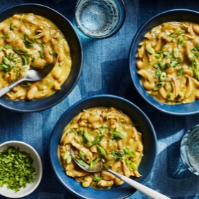

# [White Chili with Chicken](https://www.seriouseats.com/white-chili-with-chicken-best)
> **tags**: # #0star

## Description

## Ingredients

- 1 pound dried small white (Navy) beans, Great Northern beans, or cannellini beans (see note)
- Kosher salt
- 2 fresh poblano chiles
- 4 fresh Anaheim or Hatch chiles
- 2 jalapeño chiles
- 1 medium onion, peeled, trimmed, and split in halt from top to bottom
- 8 medium cloves garlic
- 3 tablespoons vegetable or canola oil, divided
- 1 quart homemade or store-bought low-sodium chicken stock
- 1 whole pickled jalapeño pepper, plus 2 tablespoons pickling liquid from the can
- 1 tablespoon ground cumin
- 1 teaspoon ground coriander seeds
- 4 (8-ounce) boneless skinless chicken breast halves
- 1 pound shredded pepper Jack cheese, divided
- 2 tablespoons fresh juice from 2 whole limes, plus 1 whole lime cut into wedges for serving
- 1 cup roughly chopped fresh cilantro leaves, divided
- 4 to 6 scallions, white and light green parts only, thinly sliced

## Directions
Cover beans with 1 gallon (4 quarts) water. Add 1/4 cup salt and stir until dissolved. Cover and let rest at room temperature at least 8 hours and up to 24. Drain and rinse beans.

Adjust broiler rack to 8 inches below broiler element and preheat broiler to high. Place poblanos, Anaheims, jalapeños, onion, and garlic on a foil-lined rimmed baking sheet. Toss with 1 tablespoon oil using your hands to coat. Season with salt. Place under broiler and broil, turning peppers and rearranging vegetables occasionally, until peppers are blackened on all sides and skins are wrinkled all over, 15 to 20 minutes total. Gather up foil and form a sealed pouch. Let chiles rest for 5 minutes.

Place chiles and chicken stock in a large bowl. Peel chiles under the chicken stock, leaving skins and seeds behind. Transfer chile flesh to the cup of a hand blender or a standing blender. Add broiled onion, broiled garlic, and the canned jalapeño (do not add jalapeño pickling liquid). Blend until a smooth purée is formed. Set aside.

Heat remaining 2 tablespoons oil in a large Dutch oven over medium heat until shimmering. Add cumin and coriander and cook, stirring, until fragrant, about 30 seconds. Add chile purée and cook, stirring, until incorporated. Strain chicken stock into pot, pressing on skins and seeds to extract as much liquid as possible. Discard skins and seeds.

Add soaked beans and chicken breasts to pot, adding water as necessary until beans and chicken are fully submerged. Bring to a boil, reduce to a bare simmer and cook, stirring occasionally, until chicken breasts register 150°F (66°C) on an instant-read thermometer, about 15 minutes.

Transfer chicken breasts to a bowl and let rest. Continue simmering broth and beans until beans are fully tender, about 1 hour total. Remove 1 1/2 cups of beans and their liquid and transfer to a standing blender or the work cup of an immersion blender. Blend until completely smooth. Stir back into pot.

Shred chicken into bite-size pieces and stir back into stew. Stir in half of cheese until melted. Stir in jalapeño pickling liquid, lime juice, and half of cilantro. Season to taste with salt.

Serve immediately with extra shredded cheese, lime wedges, cilantro, and scallions.

## Notes

## Data
**prep** 10 mins | **cook** 110 mins | **total**  | **serves** 6 to 8 servings