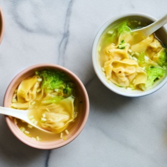

# [Wonton Soup](https://www.seriouseats.com/homemade-wonton-soup-recipe)
> **tags**: #Soup #0star

## Description

## Ingredients

### For the Broth
- 2 pounds (900g) chicken backs, wingtips, and/or bones. roughly chopped with a cleaver
- 1 1/2 pounds (680g) pig's trotters, split or sliced
- 3 ounces (85g) Chinese ham or prosciutto
- Shells taken from 24 small shrimp (shrimp flesh used to make the wontons; see ingredients list below)
- One 3- by 4-inch square (8g) kombu (see notes)
- 1 ounce (30g) dried shrimp or stockfish (optional)
- 8 scallions (150g), whites and greens reserved separately
- One 4-inch (60g) knob fresh ginger, sliced, plus 2 teaspoons (7g) grated fresh ginger
- 12 leaves (340g) Napa cabbage, cut into 2-inch pieces, divided

### For the Wontons
- 24 small shrimp (225g), shells removed and reserved for stock
- 1/2 teaspoon baking soda
- 2 teaspoons (6g) Diamond Crystal kosher salt, divided, plus more to taste; for table salt, use half as much by volume or the same weight
- 3/4 pound (340g) ground pork
- 2 teaspoons (10g) sugar
- 1 teaspoon (5ml) soy sauce
- 2 teaspoons (10ml) sesame oil
- 1/2 cup (40g) yellow chives, thinly sliced, divided (see notes)
- 20 wonton wrappers, thin variety preferred

## Directions
For the Broth: Combine chicken, pork trotters, and ham in a large stockpot and cover with water. Bring to a boil over high heat. Boil for 10 minutes, then dump contents into the sink and let liquid drain. Clean bones and meat under cold running water, rubbing off any scum or blood clots that may appear and return to the stockpot.

Fill stockpot with cold water until water is about 1 inch above the surface of the bones. Add reserved shrimp shells, kombu, dried shrimp or stockfish (optional), scallion whites, sliced ginger, and 4 cabbage leaves. Bring to a boil over high heat, reduce to a bare simmer, and cook, uncovered, until broth is deeply flavorful, about 2 hours.

Using tongs, discard bones from broth. Strain through a fine-mesh strainer into a large saucepan and discard solids. Defat broth with a ladle if using the same day. Broth can also be transferred to sealed containers, refrigerated overnight, then skimmed the next day, using a spoon to remove the solid fat from the top.

For the Wontons: Place shelled shrimp in a small bowl. Add baking soda, 1 teaspoon salt, and 1/4 cup (60ml) water and mix with fingers. Set aside for at least 15 minutes and up to 1 day in the refrigerator. Drain when ready.

Meanwhile, combine pork, grated fresh ginger, sugar, soy sauce, sesame oil, half of chives, and remaining 1 teaspoon salt in a medium bowl. Mix with fingers until thoroughly combined. To test for seasoning, place a small amount on a microwave-safe plate and microwave on high power until cooked through, about 10 seconds. Taste for seasoning and add more salt as necessary.

Place one wonton wrapper in the center of the cutting board, keeping the rest covered in plastic. Place a 1 tablespoon-sized portion of pork filling in center of wrapper, and top with a single shrimp. Using your finger tip, moisten the wrapper with water around the edge.

Lift two opposite corners up to meet at a point, then use your fingertips to seal the rest of the sides, forming a triangle, and squeezing out as much air as possible.

Pull the two opposite corners towards each other to form the triangle into a plump folded crescent shape, using a little water to seal the edges. Transfer to a plate and repeat with remaining wontons.

For the Soup: Bring broth to a boil. Season with salt to taste. Add wontons and cabbage and cook until wontons are cooked through, about 3 minutes. Stir in remaining chives and remove from heat. Allow to cool for 1 minute. Serve immediately.

## Notes

## Data
**prep** 60 mins | **cook** 2 hrs 30 mins | **total**  | **serves** 4 servings